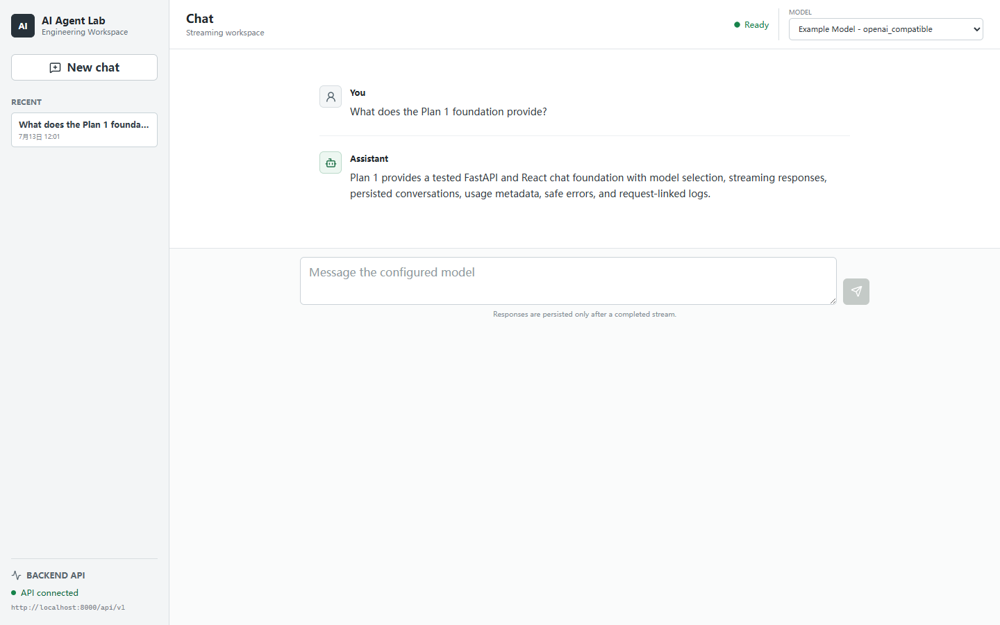
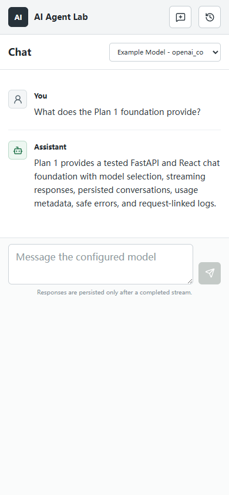
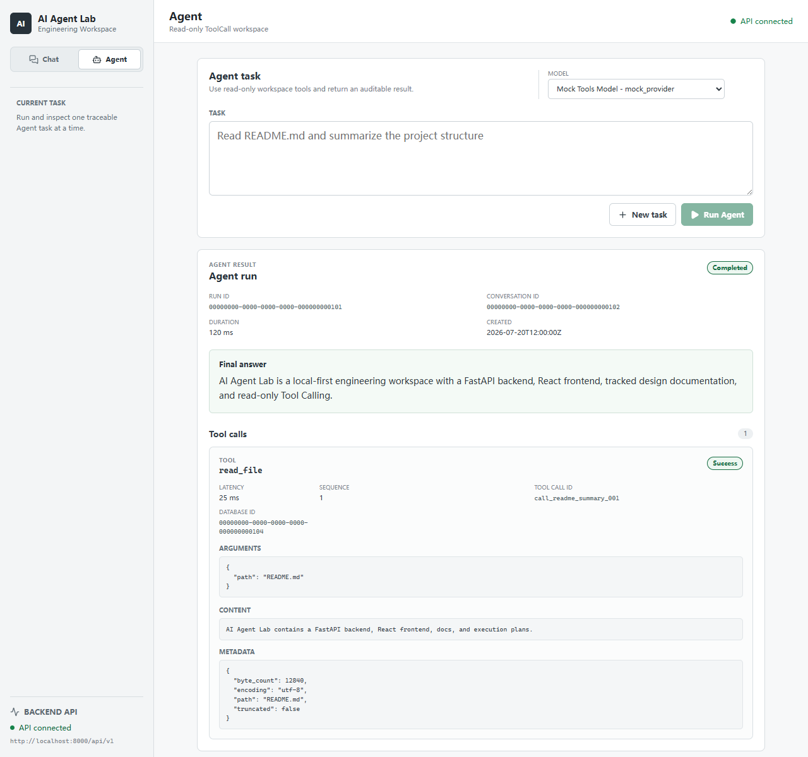
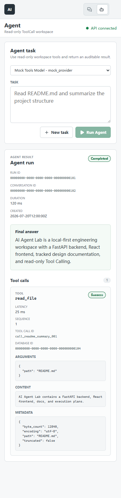

# AI Agent Lab

[English](README.md) | [中文](README_CN.md)

AI Agent Lab is a staged AI Engineering Workspace for learning and building the core systems behind modern AI applications. It starts with a stable FastAPI + React foundation and grows through chat, provider abstraction, tool calling, RAG, traceability, memory, agent runtime, MCP, voice, vision, and desktop workflows.

This repository is not a collection of disconnected demos. The goal is to build a usable, observable, testable, and extensible AI engineering workspace one plan at a time.

## Current Stage

Latest existing Git tag: `v0.1.0` (Plan 1 foundation). The `v0.2.0` Plan 2
release candidate has passed its final Codex review; the user-owned release
commit and annotated tag are still pending.

Plan 1 covers:

- Project foundation
- FastAPI backend skeleton
- React + TypeScript frontend skeleton
- Basic health check
- Basic chat workflow
- LLM provider abstraction
- OpenAI-compatible provider support
- Streaming chat
- Conversation history
- Basic token, cost, latency, logging, and error handling

Completed scope: `P1-M1-S1` through `P1-M4-S8`.

Current development stage: Plan 2 implementation and final review are complete
through `P2-M5-S7`. All five Plan 3 bridge contracts have been revalidated.
`P2-M5-S8` remains open only for the user-created `v0.2.0` release commit/tag
and the subsequent tag-target verification.

The M1 foundation includes Tool and ToolResult contracts, ToolCall transport
schemas, an ordered Tool Registry, Draft 2020-12 argument validation, read-only
path policy, and AgentRun/ToolCall ORM models with an Alembic migration. M2
adds the two registered read-only builtins `read_file` and `list_dir`, with
bounded I/O, workspace-relative path policy, sensitive-name filtering, safe
failures, and mocked regression coverage. `web_fetch` was evaluated in
`P2-M2-S7` and explicitly deferred because a trustworthy network Tool requires
a complete SSRF, DNS/redirect, timeout, response-size, content-type, and text-
extraction boundary. No `web_fetch` Tool or schema is implemented or exposed.
`P2-M3-S1` through `P2-M3-S3` add typed non-streaming Provider Tool
definitions and Tool Calls, a defensive Registry-to-Provider schema adapter,
and safe OpenAI-compatible `tools` request/response mapping. The tracked
example model remains `supports_tools=false`, and streaming Tool Calls fail
locally before HTTP because the current implementation does not aggregate Tool
Call deltas. `P2-M3-S4` through `P2-M3-S8` add a backend-only Simple Agent
service. It can return a direct answer or run a bounded non-streaming loop with
ordered Tool Calls, correlated observations, per-Tool timeouts, bounded
Provider observations, structured failed results, and AgentRun/ToolCall audit
rows. One Provider decision is one step; `max_steps` defaults to 3 and is
limited to 10. There is no automatic retry. The tracked model therefore cannot
run this path without an explicit tools-capable local configuration.
`P2-M4-S1` through `P2-M4-S3` add validated Agent request/response schemas,
`POST /api/v1/agents/runs`, and AgentRun/ToolCall query endpoints. Completed and
structured failed runs both commit and return HTTP 201; read-only queries do not
initialize Provider configuration. `P2-M4-S4` through `P2-M4-S6` add a dedicated
Agent workspace, a typed Agent API client, and bounded ToolCall cards/timeline.
The sidebar switches between Chat and Agent without changing the Chat flow. The
Agent selector only offers Registry models with `supports_tools=true`; completed
and structured failed runs show their final result, ToolCall audit fields, and
traceable IDs. `?workspace=agent&run=<uuid>` restores a persisted run and its
ToolCalls. The tracked example model still has Tool support disabled, so browser
acceptance uses local mocks rather than a live Provider.

`P2-M5-S1` through `P2-M5-S3` harden the Tool and Agent test boundary. Standard
JSON validation now rejects non-finite numbers, `.env*` path protection includes
`.envrc`, automated checks lock the `web_fetch` deferral to zero executable
surface, and a Mock Provider plus temporary SQLite/workspace API test verifies a
safe failed ToolCall can still lead to a completed final answer. `P2-M5-S4`
through `P2-M5-S6` refresh frontend type/test/build and local mocked browser
evidence, synchronize the current Tool/Agent documents, and add sanitized Plan 2
desktop/mobile release-candidate screenshots. No frontend runtime behavior was
changed for those checks.

Next action: manually commit this verified release candidate, create annotated
tag `v0.2.0`, then verify the tag target before beginning `P3-M1-S1`.

## v0.1.0 Demo





These are sanitized mock demonstrations. No live Provider, real API key, or
user-local conversation database was used to create them.

## v0.2.0 Release Candidate Demo





These are sanitized local Mock demonstrations with synthetic IDs and no project
backend database. The S7 final review has passed; the images do not claim that
the user-owned `v0.2.0` tag already exists.

## Non-Goals For Plan 1

Plan 1 does not implement:

- Tool Calling
- RAG
- Memory
- MCP
- Voice
- Vision
- Desktop app
- Multi-agent workflows

Those capabilities are intentionally deferred to later plans.

## Planned Stack

- Backend: Python 3.11, FastAPI, Pydantic, SQLAlchemy, SQLite
- Frontend: React, Vite, TypeScript
- LLM access: OpenAI-compatible providers, such as DeepSeek or OpenRouter
- Testing: pytest for backend, TypeScript/build checks for frontend

The workspace is local-first and primarily single-user. SQLite is the default
and long-term supported primary database, not a temporary stop before
PostgreSQL. SQLAlchemy and Alembic preserve reasonable database portability,
but PostgreSQL remains an optional compatibility path only if deployment or
concurrency requirements materially change.

## Repository Layout

```text
AI-Agent-Lab/
├── backend/       # FastAPI backend, added incrementally during Plan 1
├── frontend/      # React + TypeScript frontend, added incrementally during Plan 1
├── docs/          # Tracked project documentation and sanitized assets
├── docs-plan/     # Tracked source planning documents and execution tables
├── docs-local/    # Ignored local drafts, private notes, and sensitive materials
├── AGENTS.md      # Root collaboration rules
├── AGENTS_CN.md   # Root Chinese collaboration rules
├── .env.example   # Root environment variable example
└── .gitignore
```

## Documentation Boundaries

- `docs-plan/` contains plan source documents and execution step tables. It is tracked.
- `docs/` contains formal project documentation and sanitized verification assets. It is tracked.
- `docs-local/` contains local drafts, private notes, temporary review material, and sensitive screenshots. It is ignored.

## Local Development

The Plan 1 backend and frontend can be started independently. The root
`.env.example` is a workspace-level reference and is not loaded automatically
by either application. Copy the service-specific examples when local overrides
are needed:

```powershell
Copy-Item backend/.env.example backend/.env
Copy-Item frontend/.env.example frontend/.env
```

Backend commands run from `backend/` read `backend/.env`; Vite commands run
from `frontend/` read `frontend/.env`. Keep those local files untracked. The
tracked examples contain no real credentials, and the frontend `VITE_*`
variables must never contain secrets because Vite exposes them to the browser.

### Backend

```bash
py -3.11 -m venv .venv
cd backend
..\.venv\Scripts\python.exe -m pip install -e .[dev] --no-build-isolation
..\.venv\Scripts\python.exe -m alembic upgrade head
..\.venv\Scripts\python.exe -m uvicorn app.main:app --reload
```

The backend defaults to `sqlite:///./ai_agent_lab.db`. Override it with
`DATABASE_URL` in a local untracked environment file when needed. Alembic owns
schema creation and currently creates `conversations`, `messages`, `llm_calls`,
`agent_runs`, and `tool_calls`; the application does not create tables during
startup. The latest Plan 2 migration also enforces that an AgentRun's optional
user Message belongs to the same Conversation.

The OpenAI-compatible Provider reads these optional environment settings when
it is initialized:

```text
OPENAI_COMPATIBLE_BASE_URL=https://api.example.com/v1
OPENAI_COMPATIBLE_API_KEY=
OPENAI_COMPATIBLE_MODEL=example-model
OPENAI_COMPATIBLE_TIMEOUT_SECONDS=30
```

Keep real values only in a local untracked `.env` file or environment
variables. The application can start without a key while it only serves the
health flow; attempting to initialize the Provider without a key raises a
readable configuration error. Batch 5 tests use mock HTTP and do not contact a
real model service.

The JSON Model Registry is stored at
`backend/app/providers/llm/models.json`. Its tracked entry is example
configuration only. Registry loading, filtering, lookup, duplicate detection,
and strict metadata validation are covered by unit tests. See
`docs/03-llm-provider.md` for Provider and Registry boundaries.

The non-streaming and SSE Chat backend flows are available:

```text
POST /api/v1/conversations
GET  /api/v1/conversations
GET  /api/v1/conversations/{conversation_id}
GET  /api/v1/conversations/{conversation_id}/messages
GET  /api/v1/models
POST /api/v1/chat/completions
POST /api/v1/chat/stream
```

The Chat endpoint accepts one new user `content` value. The backend owns and
loads persisted conversation history, validates the selected Registry model,
calls the configured Provider, and atomically stores the user message,
assistant message, and successful `LLMCall`. The SSE endpoint emits `delta`
events followed by one `done` event. A successful stream is committed before
`done`; Provider failure or client cancellation rolls back the entire turn.
Tests use mock Providers only.

The first successful user turn becomes the conversation title after whitespace
normalization and a 50-character limit. Successful turns also remember the
selected Registry model and advance conversation activity time. Conversation
and message list APIs support recent-history navigation; failed or cancelled
turns do not update this metadata.

Successful non-streaming and streaming turns persist Provider usage, Registry-
based estimated cost, and Provider latency on `LLMCall`. Missing usage or an
unknown Registry price remains `null`; the backend does not invent values.
HTTP and SSE failures use a safe structured error envelope linked to a server-
generated `X-Request-ID`. Request and model-call logs include request ID,
provider/model, outcome, and latency without logging full message content,
credentials, upstream error bodies, or SQL parameters.

Health check:

```text
GET http://localhost:8000/api/v1/health
```

Expected response:

```json
{
  "status": "ok",
  "service": "ai-agent-lab-backend"
}
```

Backend verification:

```powershell
cd backend
..\.venv\Scripts\python.exe -m pytest -q
..\.venv\Scripts\python.exe -m pip check
```

### Frontend

```bash
cd frontend
npm install
npm run dev
```

Open the Vite URL printed by `npm run dev`. The first screen is the Chat
workspace with API health, configured model identity, message states, streaming
output, Stop, and New Chat controls. The frontend reads these safe defaults:

```text
VITE_API_BASE_URL=http://localhost:8000/api/v1
VITE_DEFAULT_PROVIDER=openai_compatible
VITE_DEFAULT_MODEL=example-model
```

The API health area shows `Checking API`, `API connected`, or `API unavailable`.
Workspace initialization has a distinct loading state while models and recent
conversations load. If initialization fails, one readable error and a `Retry`
button are shown; a successful retry returns to the ready workspace without an
automatic retry loop. Once ready, Chat has empty, conversation-loading,
streaming, completed, stopped, and error states. The model selector is populated
from `GET /api/v1/models`; the sidebar loads recent conversations and their
persisted messages. The selected conversation is stored in
`?conversation=<uuid>`, so refreshing restores its messages and last successful
model. Stopping preserves partial text locally, but the interrupted turn is not
persisted. Late history and conversation-list refresh responses are ignored,
and a terminal SSE error actively releases the response reader.

Use the sidebar `Agent` control to open the read-only Agent workspace. It only
lists Registry models that advertise Tool support. A synchronous run displays
its final answer, status/error, ToolCall arguments, result summary, latency, and
AgentRun/Conversation/Provider-call/database IDs. The run UUID is stored in the
URL so refresh can reload the persisted run and ToolCalls. There is no Agent run
list, polling, streaming, cancel/resume, or automatic retry in the current UI.
The tracked example Registry model intentionally remains
`supports_tools=false`, so the Agent form has no runnable model until a local
operator explicitly configures a tools-capable Registry entry and Provider.
Keep real Provider credentials only in an untracked `backend/.env` or process
environment; never place them in Registry JSON or frontend `VITE_*` variables.

Frontend checks:

```powershell
cd frontend
npm run typecheck
npm run test
npm run build
```

Release documentation:

- [Changelog](CHANGELOG.md)
- [Plan 1 foundation release](docs/02-plan-1-foundation.md)
- [Architecture](docs/01-architecture.md)
- [LLM Provider and Model Registry](docs/03-llm-provider.md)
- [Tool Calling design](docs/10-tool-calling-design.md)
- [Simple Agent Loop](docs/11-simple-agent-loop.md)
- [Agent API](docs/12-agent-api.md)
- [Plan 2 basic Agent release candidate](docs/13-plan-2-basic-agent.md)
- [Plan 1 final review record](docs/reviews/2026-07-13-plan1-v0.1.0-final-review.md)
- [Plan 2 final review record](docs/reviews/2026-07-19-plan2-v0.2.0-final-review.md)
- `docs-plan/00-ALL PLAN/01-PLAN-1 (V1.0).md`
- `docs-plan/01-PLAN1/01-PLAN1-执行步骤表 (V1.0).md`

## Known Limitations

Release verification uses mock Providers; it does not prove live
DeepSeek/OpenRouter connectivity. Usage, estimated cost, and latency are stored
on backend `LLMCall` records but are not displayed in the frontend. The current
editable-install workflow also leaves `models.json` out of future wheel/sdist
package data. Provider retry/fallback, failed-call audit rows, conversation
management extensions, Markdown rendering, and later-Plan features remain
deferred. Agent execution is synchronous/non-streaming and has no run list,
polling, cancel/resume/retry, strict persisted ToolCall sequence, or live
Provider acceptance. The tracked model is not enabled for Tools, Agent Provider
calls are not linked to `LLMCall` usage/cost rows, and `web_fetch` remains
explicitly deferred with no runtime surface. See the
[Plan 1 foundation release](docs/02-plan-1-foundation.md),
[Agent API](docs/12-agent-api.md), and
[Plan 2 release candidate](docs/13-plan-2-basic-agent.md) and
[Plan 2 final review](docs/reviews/2026-07-19-plan2-v0.2.0-final-review.md) for
the complete current boundaries.

## Roadmap

- Plan 1: Project foundation + Basic Chat + LLM Providers
- Plan 2: Tool Calling + Simple Agent Loop
- Plan 3: Knowledge Base + Document Ingestion + Naive RAG
- Plan 4: Trace + Advanced RAG + Rerank + Evaluation
- Plan 5: Memory + Context Engine + Agent Runtime + Human Approval
- Plan 6: MCP + Voice + Vision + Desktop
