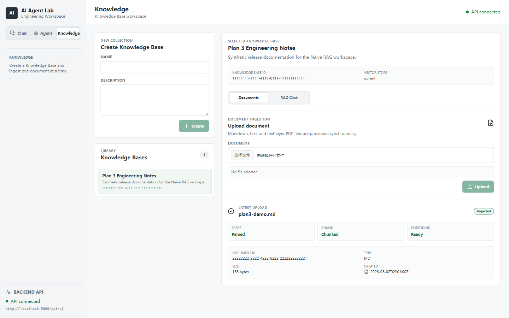
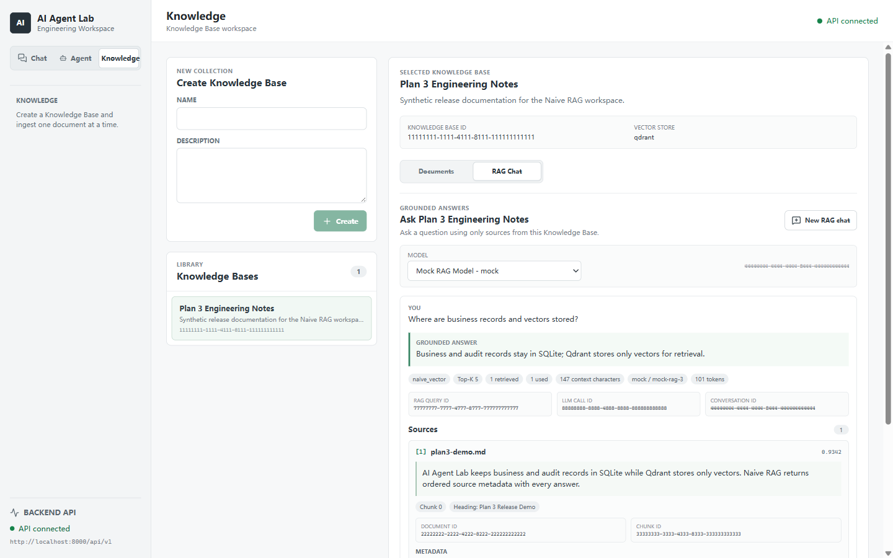

# AI Agent Lab

[English](README.md) | [中文](README_CN.md)

AI Agent Lab is a staged AI Engineering Workspace for learning and building the core systems behind modern AI applications. It starts with a stable FastAPI + React foundation and grows through chat, provider abstraction, tool calling, RAG, traceability, memory, agent runtime, MCP, voice, vision, and desktop workflows.

This repository is not a collection of disconnected demos. The goal is to build a usable, observable, testable, and extensible AI engineering workspace one plan at a time.

## Current Stage

Plan 3 Knowledge Base + Naive RAG was released as the annotated `v0.3.0` tag at
commit `46ea94a`. An independent post-release audit repaired embedding-identity
isolation and compatible concurrent collection creation; the user published
those repairs as annotated `v0.3.1` at `6bcf423` while preserving the original
tag. Plan 4 M1 is complete through `P4-M1-S7`, and M2 is complete through
`P4-M2-S6`: standalone RAG Query now records retrieval Runs/candidates, while
RAG Chat records ordered retrieval, Prompt, LLM, and final-answer Steps with
durable retrieval evidence on Provider failure. Agent/Tool hooks, Trace API,
and Timeline UI are not yet implemented.

Plan 1 covers:

- Project foundation
- FastAPI backend skeleton
- React + TypeScript frontend skeleton
- Basic health check
- Basic chat workflow
- LLM provider abstraction
- OpenAI-compatible provider support
- Streaming chat
- Conversation history
- Basic token, cost, latency, logging, and error handling

Verified implementation scope: `P1-M1-S1` through `P4-M2-S6`, including the
Plan 3 final-audit repair, Plan 4 M1 Trace foundation, LLM Trace integration,
and Naive RAG retrieval/Prompt/answer Trace persistence.

Current development stage: all Plan 2 milestones, the original `v0.2.0`
release, and the `v0.2.1` audit patch are complete. All five Plan 3 bridge
contracts were revalidated. Plan 3 M1 is complete through `P3-M1-S9`: release
handoff review, Qdrant configuration, explicit RAG/Knowledge ownership
boundaries, four knowledge persistence models, and a tested backend Knowledge
Base CRUD service/API. The first Plan 3 M2 batch adds controlled multipart
Document upload, bounded local storage, SHA-256/type/size validation, same-KB
duplicate rejection, and safe transaction rollback cleanup. The second M2
batch adds independently testable Markdown, TXT, and text-layer PDF parsers
with source metadata and an explicit scanned-PDF/OCR limitation. The final M2
batch adds deterministic text cleaning, bounded overlapping Chunking, and a
synchronous upload-to-`DocumentChunk` pipeline with visible lifecycle errors.
The first M3 batch adds a vendor-neutral asynchronous Embedding Provider
contract, immutable validated batch vectors with token usage, and an ordered
runtime Registry that selects Provider instances by exact configured name.
The second M3 batch adds an OpenAI-compatible `/embeddings` adapter with batch
and query requests, safe HTTP/response errors, independent lazy Settings, and
strict configured-dimension validation.
The third M3 batch adds a vendor-neutral asynchronous VectorStore contract,
an official Qdrant 1.15.x adapter for COSINE collection create/check, vector
upsert, Knowledge-Base-filtered search, and Document-filtered deletion, plus a
strict Chunk payload builder that preserves content and source metadata for M4.
The final M3 batch connects the synchronous upload transaction to deterministic
batch Embedding and Qdrant upsert, persists every Chunk UUID as its point ID,
marks the Document `ready` or a safe `failed` state, and compensates vectors on
normal request-transaction rollback.
The first M4 batch adds an independent Naive Vector Retriever. It validates a
query, Knowledge Base UUID, Top-K and optional score threshold before external
calls, generates exactly one query embedding, performs a Knowledge-Base-filtered
VectorStore search, and maps ordered hits into immutable source-rich
`RetrievalResult` values.
The second M4 batch adds a bounded independent RAG Prompt Builder, a
retrieval-only `/api/v1/rag/query` endpoint that does not resolve an LLM, and a
non-streaming `/api/v1/rag/chat` endpoint that reuses existing Conversations,
persists the raw user question, assistant answer, and `LLMCall`, and returns
answer, indexed sources, and retrieval/Prompt metadata.
The final M4 batch persists one `RagQuery` audit for every successful Query,
Chat, or Agent Tool retrieval, including requested Top-K, ordered source
snapshots, retrieval latency, and optional Conversation/answer links. Both RAG
APIs return `rag_query_id`. The read-only `search_knowledge_base` Tool reuses
that service, bounds Top-K to 20 and source excerpts to 600 characters, marks
retrieved text as untrusted data, and is initialized lazily so an ordinary
Plan 2 Agent run does not require Embedding or Qdrant configuration.
The first M5 batch adds a third responsive Knowledge workspace with typed
Knowledge Base/Document contracts, safe list/create/multipart API wrappers,
explicit loading/empty/error states, and a selected-Knowledge-Base upload flow.
The UI accepts `.md`, `.txt`, and `.pdf`, then displays the synchronous
Document response's parse, chunk, and embedding lifecycle without exposing
stored paths, hashes, or raw metadata.
The final M5 batch adds typed RAG Query/Chat contracts, safe API wrappers, and
a focused RAG store inside the Knowledge workspace. The Documents/RAG Chat tabs
reuse the selected Knowledge Base; the first question creates a dedicated
Conversation, subsequent questions reuse it, and `New RAG chat` starts a fresh
session. Each non-streaming answer shows the exact ordered source filename,
Chunk index/content, score, heading/page metadata, stable nested metadata, and
RagQuery/LLMCall/Conversation correlation IDs returned by the backend. Client
ownership checks reject mismatched Knowledge Base, Conversation, source, index,
or source-count responses instead of displaying untrusted cross-session data.

M6 re-audits every Plan 3 backend layer without adding duplicate low-value
tests: the S1～S3 data/API/processing/pipeline group reached `339 passed`, and
the S4 Query/Chat/Tool group reached `112 passed`. Complete backend regression
reached `1024 passed` with one known Starlette/httpx deprecation warning;
frontend verification reached `25` files / `149` tests and a production build
of `1826` transformed modules. A fresh synthetic browser Demo verified upload,
`parsed/chunked/ready`, one dedicated Conversation, grounded answer/source
display, narrow layout, and zero request/console issues. A real local Qdrant
smoke used a random collection and the production adapter, proved Knowledge
Base isolation and Document-scoped deletion, then removed and rechecked the
collection. Package/OpenAPI/frontend metadata is now `0.3.0`; the final
annotated tag is intentionally left to the user's Git workflow.

The M1 foundation includes Tool and ToolResult contracts, ToolCall transport
schemas, an ordered Tool Registry, Draft 2020-12 argument validation, read-only
path policy, and AgentRun/ToolCall ORM models with an Alembic migration. M2
adds the two registered read-only builtins `read_file` and `list_dir`, with
bounded I/O, workspace-relative path policy, sensitive-name filtering, safe
failures, and mocked regression coverage. `web_fetch` was evaluated in
`P2-M2-S7` and explicitly deferred because a trustworthy network Tool requires
a complete SSRF, DNS/redirect, timeout, response-size, content-type, and text-
extraction boundary. No `web_fetch` Tool or schema is implemented or exposed.
`P2-M3-S1` through `P2-M3-S3` add typed non-streaming Provider Tool
definitions and Tool Calls, a defensive Registry-to-Provider schema adapter,
and safe OpenAI-compatible `tools` request/response mapping. The tracked
example model remains `supports_tools=false`, and streaming Tool Calls fail
locally before HTTP because the current implementation does not aggregate Tool
Call deltas. `P2-M3-S4` through `P2-M3-S8` add a backend-only Simple Agent
service. It can return a direct answer or run a bounded non-streaming loop with
ordered Tool Calls, correlated observations, per-Tool timeouts, bounded
Provider observations, structured failed results, and AgentRun/ToolCall audit
rows. `max_steps` defaults to 3, is limited to 10, and bounds ToolCall
executions: a whole Provider batch that does not fit is rejected atomically,
while an exactly budgeted run may make one final Provider decision. The whole
run also has a configurable deadline. There is no automatic retry. The tracked
model therefore cannot run this path without an explicit tools-capable local
configuration.
`P2-M4-S1` through `P2-M4-S3` add validated Agent request/response schemas,
`POST /api/v1/agents/runs`, and AgentRun/ToolCall query endpoints. Completed and
structured failed runs both commit and return HTTP 201; read-only queries do not
initialize Provider configuration. `P2-M4-S4` through `P2-M4-S6` add a dedicated
Agent workspace, a typed Agent API client, and bounded ToolCall cards/timeline.
The sidebar switches between Chat and Agent without changing the Chat flow. The
Agent selector only offers Registry models with `supports_tools=true`; completed
and structured failed runs show their final result, ToolCall audit fields, and
traceable IDs. `?workspace=agent&run=<uuid>` restores a persisted run and its
ToolCalls. The tracked example model still has Tool support disabled, so browser
acceptance uses local mocks rather than a live Provider. ToolCalls expose a
strict one-based `sequence_index`; the UI summarizes large arguments and uses
`Tool Call ID` only for the Provider correlation ID. A completed POST stores
only its run UUID in tab-scoped session storage, so leaving and reopening Agent
can recover the result without allowing a stale response to rewrite the Chat
URL.

`P2-M5-S1` through `P2-M5-S3` harden the Tool and Agent test boundary. Standard
JSON validation now rejects non-finite numbers, `.env*` path protection includes
`.envrc`, automated checks lock the `web_fetch` deferral to zero executable
surface, and a Mock Provider plus temporary SQLite/workspace API test verifies a
safe failed ToolCall can still lead to a completed final answer. `P2-M5-S4`
through `P2-M5-S6` refresh frontend type/test/build and local mocked browser
evidence, synchronize the current Tool/Agent documents, and add sanitized Plan 2
desktop/mobile release screenshots. S7～S8 completed the original `v0.2.0`
review, release commit, annotated tag, push, and tag-target gate.

The published `v0.2.1` audit patch adds a shared 64 KiB standard-JSON Tool
argument limit, 4096-character built-in path limit, private-key content checks,
and no-symlink/reparse traversal. `list_dir` now bounds enumeration, Agent
dispatch denies non-read-only Tools, invalid or blocked arguments are redacted
before persistence, Agent runs have a total timeout, and ToolCall order is
persisted explicitly. `web_fetch` remains deferred and has no runtime surface.

Plan 3 builds on `v0.2.1`; it does not downgrade the active baseline to
`v0.2.0`.

Alembic revision `20260726_0005` adds the SQLite `knowledge_bases`,
`documents`, `document_chunks`, and `rag_queries` tables. Their ORM and Pydantic
contracts preserve knowledge/document ownership, ingestion lifecycle states,
SHA-256 hashes, source metadata, vector IDs, retrieved chunk snapshots, and
optional answer-message linkage. `KnowledgeBaseService` and the five plural
`/api/v1/knowledge-bases` CRUD routes now expose metadata management with
partial `PATCH`, safe not-found responses, and request-scoped transactions.
The nested Document upload POST now accepts `.md`, `.txt`, and `.pdf` files and
returns the final result of synchronous parsing, cleaning, and basic Chunking.
Pure parsers extract Markdown structure, deterministically decoded TXT, and
page-aware text-layer PDF content. Successful uploads persist ordered
`DocumentChunk` rows and return `parsed` / `chunked`; expected parser or
content failures remain HTTP 201 resources with safe visible failure states.
Patch revision `20260801_0006` makes same-Knowledge-Base document hashes unique,
restricts deletion of a Knowledge Base that still owns Documents, and safely
clears a deleted answer Message reference without losing its `RagQuery`.
The upload pipeline now calls the configured Embedding Provider and VectorStore,
persists `DocumentChunk.vector_id`, and returns `embedding_status=ready` after a
successful waited Qdrant write. The standalone Retriever now returns ordered,
source-rich Top-K Chunks for one Knowledge Base. The RAG query endpoint exposes
retrieval results without an LLM call, while the RAG chat endpoint produces one
grounded non-streaming answer and writes it to existing conversation history.
Revision `20260801_0007` adds a strict persisted `top_k` field to
`rag_queries`. Successful Query, Chat, and `search_knowledge_base` Tool calls
now write traceable audit rows and return their IDs. The Knowledge workspace
provides a current-session non-streaming RAG Chat and exact source cards, but
Document list/detail/chunk-query/delete APIs remain deferred. It therefore
cannot reload persistent Document or RAG source history after refresh, preview
Chunks outside an answer, or expose the Agent knowledge Tool through the UI.
Plan 4 revision `20260808_0009` adds `rag_retrieval_runs` and
`rag_retrieval_candidates`. Standalone Query and RAG Chat persist strategy,
embedding identity, ordered candidate/source snapshots, Prompt source usage,
and answer linkage under a shared Trace Run without changing either API
response.

## v0.1.0 Demo


These are sanitized mock demonstrations. No live Provider, real API key, or
user-local conversation database was used to create them.

## v0.2.0 Release Demo


These are sanitized local Mock demonstrations with synthetic IDs and no project
backend database. They are evidence for the published `v0.2.0` release; they do
not prove live Provider Tool capability.

## v0.3.0 Release Candidate Demo





These are sanitized local Mock demonstrations with synthetic documents,
identifiers, Provider responses, and audit metadata. The clean acceptance used
no real API key, paid Provider, user SQLite database, or network Tool. Desktop
`1440×900` and narrow `390×844` layouts passed; the committed images are the
release evidence for the user-created `v0.3.0` tag.

## Non-Goals For Plan 1

Plan 1 does not implement:

- Tool Calling
- RAG
- Memory
- MCP
- Voice
- Vision
- Desktop app
- Multi-agent workflows

Those capabilities are intentionally deferred to later plans.

## Planned Stack

- Backend: Python 3.11, FastAPI, Pydantic, SQLAlchemy, SQLite
- Frontend: React, Vite, TypeScript
- LLM access: OpenAI-compatible providers, such as DeepSeek or OpenRouter
- Testing: pytest for backend, TypeScript/build checks for frontend

The workspace is local-first and primarily single-user. SQLite is the default
and long-term supported primary database, not a temporary stop before
PostgreSQL. SQLAlchemy and Alembic preserve reasonable database portability,
but PostgreSQL remains an optional compatibility path only if deployment or
concurrency requirements materially change.

## Repository Layout

```text
AI-Agent-Lab/
├── backend/       # FastAPI backend, added incrementally during Plan 1
├── frontend/      # React + TypeScript frontend, added incrementally during Plan 1
├── docs/          # Tracked project documentation and sanitized assets
├── docs-plan/     # Tracked source planning documents and execution tables
├── docs-local/    # Ignored local drafts, private notes, and sensitive materials
├── AGENTS.md      # Root collaboration rules
├── AGENTS_CN.md   # Root Chinese collaboration rules
├── .env.example   # Root environment variable example
└── .gitignore
```

## Documentation Boundaries

- `docs-plan/` contains plan source documents and execution step tables. It is tracked.
- `docs/` contains formal project documentation and sanitized verification assets. It is tracked.
- `docs-local/` contains local drafts, private notes, temporary review material, and sensitive screenshots. It is ignored.

## Local Development

The Plan 1 backend and frontend can be started independently. The root
`.env.example` is a workspace-level reference and is not loaded automatically
by either application. Copy the service-specific examples when local overrides
are needed:

```powershell
Copy-Item backend/.env.example backend/.env
Copy-Item frontend/.env.example frontend/.env
```

Backend commands run from `backend/` read `backend/.env`; Vite commands run
from `frontend/` read `frontend/.env`. Keep those local files untracked. The
tracked examples contain no real credentials, and the frontend `VITE_*`
variables must never contain secrets because Vite exposes them to the browser.

### Qdrant

Plan 3 uses Qdrant only for vector storage; SQLite remains the primary database
for business and audit records. Start the pinned local service from the
repository root, then check its native health endpoint:

```powershell
docker compose up -d qdrant
Invoke-RestMethod http://localhost:6333/healthz
```

The backend uses lazy, non-secret VectorStore configuration:

```text
QDRANT_URL=http://localhost:6333
QDRANT_COLLECTION_NAME=ai_agent_lab_chunks
QDRANT_TIMEOUT_SECONDS=10
```

Override these values only in an untracked `backend/.env` or process
environment. `qdrant-client` is pinned to the server's 1.15 minor. The adapter
creates one default COSINE dense-vector collection or fail-closes when an
existing collection has a different dimension, distance, or named-vector
shape. Concurrent first writers re-read and validate the winning collection
instead of leaving an otherwise valid upload failed. Search always filters
`knowledge_base_id`, embedding Provider, and the
actual model identity returned by the Provider; Document vector deletion
matches both Knowledge Base and Document IDs. Each payload stores canonical
Knowledge Base/Document/Chunk UUIDs, embedding Provider/model identity,
filename, chunk index, content, optional heading/page, and nested source
metadata. The upload ingestion pipeline now uses these operations and persists
each Chunk UUID as its Qdrant point ID.

The tracked Compose configuration disables Qdrant telemetry. On 2026-08-01,
the pinned
`qdrant/qdrant:v1.15.4` container was verified running with zero restarts and
`/healthz` returned HTTP 200 with `healthz check passed`. This no-key Compose
service is for local development only; Compose binds port 6333 only to
`127.0.0.1`, and it must not be exposed to an untrusted network.

### Document Upload Storage

The backend accepts one multipart upload at
`POST /api/v1/knowledge-bases/{knowledge_base_id}/documents`. Local files are
streamed through `backend/uploads/.staging/` and promoted to
`<knowledge_base_uuid>/<document_uuid>.<md|txt|pdf>`; SQLite stores only that
relative POSIX path. Configure the non-secret limits in an untracked
`backend/.env` when needed:

```text
DOCUMENT_STORAGE_ROOT=./uploads
DOCUMENT_MAX_UPLOAD_BYTES=20971520
DOCUMENT_MAX_FILES_PER_KNOWLEDGE_BASE=50
DOCUMENT_MAX_PDF_PAGES=500
DOCUMENT_MAX_EXTRACTED_CHARACTERS=10000000
DOCUMENT_MAX_MARKDOWN_STRUCTURES=20000
DOCUMENT_MAX_CHUNKS=10000
RAG_CHUNK_SIZE=1000
RAG_CHUNK_OVERLAP=150
RAG_MAX_CONTEXT_CHARACTERS=12000
```

Uploads are non-empty, limited to 20 MiB, and deduplicated by SHA-256 within
one Knowledge Base. Identical content is allowed in a different Knowledge Base.
Stored paths must exactly match the lowercase canonical form
`<knowledge_base_uuid>/<document_uuid>.<md|txt|pdf>`; absolute paths, mixed
separators, dot segments, and UUID/suffix case variants are rejected.
Request rollback removes a newly promoted file, but process termination can
leave an orphan. Each accepted upload synchronously runs the parser, Cleaner,
and Chunker before the request commits. Storage, database, and unexpected
processing errors use the existing safe error responses and roll back the
Document, chunks, and promoted file. Deleting a Knowledge Base that still owns
any Document returns HTTP 409 and preserves its rows and controlled files.
Document deletion, file lifecycle cleanup, and orphan scanning are not
implemented. The runtime upload directory is ignored and must never be
committed.

### Naive RAG APIs

`POST /api/v1/rag/query` accepts a Knowledge Base UUID, query, Top-K, and
optional score threshold. It returns ordered retrieval results and metadata
plus a traceable `rag_query_id`, without resolving or calling an LLM Provider.
`POST /api/v1/rag/chat` also
accepts an existing Conversation UUID plus Provider/model selection, performs
one non-streaming grounded answer turn, and returns answer, indexed sources,
usage, retrieval/Prompt metadata, and the linked `rag_query_id`. A tools-capable
Simple Agent can call the read-only `search_knowledge_base` Tool with
`knowledge_base_id`, `query`, and optional `top_k` from 1 through 20. See
[Naive RAG Query and Chat](docs/23-naive-rag.md) for complete contracts and
safe error behavior.

### Document Processing

`app.rag.parsers` exposes one immutable `ParsedDocument` result contract and
independent parsers for stored Markdown, TXT, and text-layer PDF files.
Markdown keeps its original markup while reporting headings and fenced code
blocks. Code-block metadata stores only `language`, `start_line`, and
`end_line`, not a second copy of the code content. TXT supports strict UTF-8,
UTF-8 BOM, and BOM-marked UTF-16. PDF parsing
uses `pypdf`, preserves one-based page metadata, and returns a readable
limitation for scanned or image-only PDFs because Plan 3 does not include OCR.

The Cleaner normalizes line endings, removes bounded control/format characters,
collapses whitespace-only blank-line runs outside fenced code, preserves every
blank line inside a fence and per-page PDF boundaries, and updates Markdown
heading/code-block line metadata. The
Chunker defaults to 1,000 characters with 150-character overlap, prefers
paragraph then line boundaries in the latter half of a window, never crosses
PDF pages, and preserves heading/page provenance. Its `token_count` is a
deterministic UTF-8 byte estimate (`ceil(bytes / 4)`), not tokenizer billing
data. Processing also rejects PDFs over 500 pages, extracted text over
10,000,000 characters, Markdown metadata over 20,000 structures, or a document
that would produce more than 10,000 chunks. Chunk headings are bounded to 512
characters.

Successful uploads return HTTP 201 with `parse_status=parsed`,
`chunk_status=chunked`, and `embedding_status=ready`; every stored Chunk has
`vector_id == str(chunk.id)`. Invalid encoded text or unreadable content returns
HTTP 201 with `failed` / `failed` / `failed`; text that becomes empty after
cleaning returns `parsed` / `failed` / `failed`. Provider or VectorStore
failures keep parsed/chunked rows, return `embedding_status=failed`, persist a
fixed safe message, and leave every Chunk `vector_id` empty.

The upload request remains synchronous. A successful Qdrant upsert registers
request-transaction cleanup so a later SQLite commit failure best-effort deletes
the Document vectors before closing the Qdrant client. See
[Document Ingestion Pipeline](docs/22-document-ingestion-pipeline.md).

### Plan 3 Demo Flow

After Qdrant, backend, and frontend are running:

1. Open the `Knowledge` workspace.
2. Create or select a Knowledge Base.
3. Upload one `.md`, `.txt`, or text-layer `.pdf` file and wait for
   `Parsed / Chunked / Ready`.
4. Switch to `RAG Chat`, select a configured model, and ask a question.
5. Inspect the grounded answer, ordered source cards, score, heading/page
   metadata, and RagQuery/LLMCall/Conversation IDs.

The first RAG question creates a dedicated Conversation; later questions reuse
it until `New RAG chat` is selected. The flow is synchronous and non-streaming.
Refreshing does not restore prior Document/RAG source cards because persistent
Document and RagQuery read APIs are outside Plan 3.

### Backend

```bash
py -3.11 -m venv .venv
cd backend
..\.venv\Scripts\python.exe -m pip install -e .[dev] --no-build-isolation
..\.venv\Scripts\python.exe -m alembic upgrade head
..\.venv\Scripts\python.exe -m uvicorn app.main:app --reload
```

The backend defaults to `sqlite:///./ai_agent_lab.db`. Override it with
`DATABASE_URL` in a local untracked environment file when needed. Alembic owns
schema creation and currently creates `conversations`, `messages`, `llm_calls`,
`agent_runs`, `tool_calls`, `knowledge_bases`, `documents`, `document_chunks`,
`rag_queries`, `trace_runs`, `trace_steps`, `rag_retrieval_runs`, and
`rag_retrieval_candidates`; the application does not create tables during
startup. The Plan 2 migrations also enforce that an AgentRun's optional user
Message belongs to the same Conversation and that each ToolCall has a positive,
per-run unique `sequence_index`.

The OpenAI-compatible Provider reads these optional environment settings when
it is initialized:

```text
OPENAI_COMPATIBLE_BASE_URL=https://api.example.com/v1
OPENAI_COMPATIBLE_API_KEY=
OPENAI_COMPATIBLE_MODEL=example-model
OPENAI_COMPATIBLE_TIMEOUT_SECONDS=30
```

Keep real values only in a local untracked `.env` file or environment
variables. The application can start without a key while it only serves the
health flow; attempting to initialize the Provider without a key raises a
readable configuration error. Batch 5 tests use mock HTTP and do not contact a
real model service.

The OpenAI-compatible Embedding Provider uses a separate lazy configuration:

```text
EMBEDDING_PROVIDER=openai_compatible
OPENAI_COMPATIBLE_EMBEDDING_BASE_URL=https://api.example.com/v1
OPENAI_COMPATIBLE_EMBEDDING_API_KEY=
OPENAI_COMPATIBLE_EMBEDDING_MODEL=example-embedding-model
OPENAI_COMPATIBLE_EMBEDDING_DIMENSION=1536
OPENAI_COMPATIBLE_EMBEDDING_TIMEOUT_SECONDS=30
```

The concrete adapter is initialized only when requested. It sends the configured
dimension and rejects a different response dimension before any Vector Store
write. Tests use synthetic credentials and mock HTTP only. See
[Embedding Provider](docs/21-embedding-provider.md) for model, dimension,
cost, privacy, and error-handling notes.

The default JSON Model Registry is stored at
`backend/app/providers/llm/models.json`; its tracked entry intentionally keeps
`supports_tools=false`. For a local Tool-capable model, copy the secret-free
`models.local.example.json` to the ignored `models.local.json`, replace the
synthetic model identifier, and set `MODEL_REGISTRY_PATH` in the local
`backend/.env`:

```powershell
Copy-Item backend/app/providers/llm/models.local.example.json backend/app/providers/llm/models.local.json
```

Registry JSON never stores credentials. `AGENT_RUN_TIMEOUT_SECONDS` controls
the whole Agent-run deadline and defaults to `120`. Registry loading,
filtering, lookup, duplicate detection, and strict metadata validation are
covered by unit tests. See `docs/03-llm-provider.md` for Provider and Registry
boundaries.

The non-streaming and SSE Chat backend flows are available:

```text
POST /api/v1/conversations
GET  /api/v1/conversations
GET  /api/v1/conversations/{conversation_id}
GET  /api/v1/conversations/{conversation_id}/messages
GET  /api/v1/models
POST /api/v1/chat/completions
POST /api/v1/chat/stream
```

The Chat endpoint accepts one new user `content` value. The backend owns and
loads persisted conversation history, validates the selected Registry model,
calls the configured Provider, and atomically stores the user message,
assistant message, and successful `LLMCall`. The SSE endpoint emits `delta`
events followed by one `done` event. A successful stream is committed before
`done`; Provider failure or client cancellation rolls back the entire turn.
Tests use mock Providers only.

The first successful user turn becomes the conversation title after whitespace
normalization and a 50-character limit. Successful turns also remember the
selected Registry model and advance conversation activity time. Conversation
and message list APIs support recent-history navigation; failed or cancelled
turns do not update this metadata.

Successful non-streaming and streaming turns persist Provider usage, Registry-
based estimated cost, and Provider latency on `LLMCall`. Missing usage or an
unknown Registry price remains `null`; the backend does not invent values.
HTTP and SSE failures use a safe structured error envelope linked to a server-
generated `X-Request-ID`. Request and model-call logs include request ID,
provider/model, outcome, and latency without logging full message content,
credentials, upstream error bodies, or SQL parameters.

Health check:

```text
GET http://localhost:8000/api/v1/health
```

Expected response:

```json
{
  "status": "ok",
  "service": "ai-agent-lab-backend"
}
```

Backend verification:

```powershell
cd backend
..\.venv\Scripts\python.exe -m pytest -q
..\.venv\Scripts\python.exe -m pip check
```

### Frontend

```bash
cd frontend
npm install
npm run dev
```

Open the Vite URL printed by `npm run dev`. The first screen is the Chat
workspace with API health, configured model identity, message states, streaming
output, Stop, and New Chat controls. The frontend reads these safe defaults:

```text
VITE_API_BASE_URL=http://localhost:8000/api/v1
VITE_DEFAULT_PROVIDER=openai_compatible
VITE_DEFAULT_MODEL=example-model
```

The API health area shows `Checking API`, `API connected`, or `API unavailable`.
Workspace initialization has a distinct loading state while models and recent
conversations load. If initialization fails, one readable error and a `Retry`
button are shown; a successful retry returns to the ready workspace without an
automatic retry loop. Once ready, Chat has empty, conversation-loading,
streaming, completed, stopped, and error states. The model selector is populated
from `GET /api/v1/models`; the sidebar loads recent conversations and their
persisted messages. The selected conversation is stored in
`?conversation=<uuid>`, so refreshing restores its messages and last successful
model. Stopping preserves partial text locally, but the interrupted turn is not
persisted. Late history and conversation-list refresh responses are ignored,
and a terminal SSE error actively releases the response reader.

Use the sidebar `Agent` control to open the read-only Agent workspace. It only
lists Registry models that advertise Tool support. A synchronous run displays
its final answer, status/error, ToolCall arguments, result summary, latency, and
AgentRun/Conversation/Provider-call/database IDs. The run UUID is stored in the
URL so refresh can reload the persisted run and ToolCalls. There is no Agent run
list, polling, streaming, cancel/resume, or automatic retry in the current UI.
The tracked example Registry model intentionally remains
`supports_tools=false`, so the Agent form has no runnable model until a local
operator explicitly configures a tools-capable Registry entry and Provider.
Keep real Provider credentials only in an untracked `backend/.env` or process
environment; never place them in Registry JSON or frontend `VITE_*` variables.

Use the sidebar `Knowledge` control to open the Knowledge workspace. Create or
select a Knowledge Base, upload a supported document from the `Documents` tab,
then switch to `RAG Chat`. Choose a registered model and ask a question; the
first turn creates a dedicated backend Conversation and later turns reuse it.
The answer panel shows ordered source cards and audit IDs. `New RAG chat` clears
only the current frontend session and starts a new Conversation on the next
question. This flow is non-streaming and current-session only: refreshing does
not restore prior RAG turns or source cards.

Frontend checks:

```powershell
cd frontend
npm run typecheck
npm run test
npm run build
```

Release documentation:

- [Changelog](CHANGELOG.md)
- [Plan 1 foundation release](docs/02-plan-1-foundation.md)
- [Architecture](docs/01-architecture.md)
- [LLM Provider and Model Registry](docs/03-llm-provider.md)
- [Tool Calling design](docs/10-tool-calling-design.md)
- [Simple Agent Loop](docs/11-simple-agent-loop.md)
- [Agent API](docs/12-agent-api.md)
- [Plan 2 basic Agent release and patch](docs/13-plan-2-basic-agent.md)
- [Knowledge Base design](docs/20-knowledge-base-design.md)
- [Embedding Provider](docs/21-embedding-provider.md)
- [Document Ingestion Pipeline](docs/22-document-ingestion-pipeline.md)
- [Naive RAG Query and Chat](docs/23-naive-rag.md)
- [Trace Observability Foundation](docs/30-trace-observability.md)
- [Plan 1 final review record](docs/reviews/2026-07-13-plan1-v0.1.0-final-review.md)
- [Plan 2 final review record](docs/reviews/2026-07-19-plan2-v0.2.0-final-review.md)
- [Plan 3 v0.3.0 Codex final review](docs/reviews/2026-08-02-plan3-v0.3.0-final-review.md)
- [Plan 4 M1 Trace foundation final review](docs/reviews/2026-08-02-plan4-m1-final-review.md)
- [Plan 4 M2 S1-S3 LLM Trace review](docs/reviews/2026-08-08-plan4-m2-s1-s3-review.md)
- [Plan 4 M2 S4-S6 RAG Trace review](docs/reviews/2026-08-08-plan4-m2-s4-s6-review.md)
- `docs-plan/00-ALL PLAN/01-PLAN-1 (V1.0).md`
- `docs-plan/01-PLAN1/01-PLAN1-执行步骤表 (V1.0).md`

## Known Limitations

Release verification uses mock Providers; it does not prove live
DeepSeek/OpenRouter connectivity. Usage, estimated cost, and latency are stored
on backend `LLMCall` records. The RAG answer panel shows the response token total,
but it does not expose persisted cost/latency and the other workspaces do not
display those metrics. The current
editable-install workflow also leaves `models.json` out of future wheel/sdist
package data. Provider retry/fallback, failed-call audit rows, conversation
management extensions, Markdown rendering, and later-Plan features remain
deferred. Agent execution is synchronous/non-streaming and has no run list,
polling, cancel/resume/retry, AgentStep/Trace replay, or live Provider
acceptance. ToolCall order is strict, but Agent Provider calls are not linked
to `LLMCall` usage/cost rows, and `web_fetch` remains
explicitly deferred with no runtime surface. See the
[Plan 1 foundation release](docs/02-plan-1-foundation.md),
[Agent API](docs/12-agent-api.md), and
[Plan 2 release and patch](docs/13-plan-2-basic-agent.md) and
[Plan 2 final review](docs/reviews/2026-07-19-plan2-v0.2.0-final-review.md) for
the complete current boundaries.
Embedding Provider verification is still mock-only: there is no live model
service acceptance, automatic retry/batching, or persisted embedding-cost
record. Upload-to-Embedding-to-Qdrant ingestion has Mock API coverage and a
local temporary-collection smoke. The standalone Retriever and Naive RAG
Query/Chat APIs have Mock boundary coverage plus a cleaned temporary-Qdrant,
temporary-SQLite, Mock-LLM API smoke. The frontend creates a dedicated
Conversation on the first RAG question and renders current-session answers,
ordered sources, and correlation IDs. It does not restore RAG turns/sources
after refresh, and the backend-only Agent Tool has no dedicated frontend.
Query/Chat/Tool create RagQuery audit rows. Chat LLM calls create Trace runtime
records; standalone RAG Query and RAG Chat now also retain retrieval candidates,
Prompt source selection, and final-answer linkage. The Agent knowledge Tool
deliberately keeps its existing Agent-owned transaction and does not create a
standalone Trace yet. RAG streaming, Trace API/Timeline, Agent/Tool Trace hooks,
and Advanced RAG do not exist.
Returned Embedding Provider usage remains in memory. Normal request
rollback compensates vectors, while a hard process crash after Qdrant write can
still leave orphan points for later reconciliation.
Vectors written before the embedding-identity audit repair do not contain the
new identity payload fields and must be re-ingested before they can be found by
the repaired retrieval filter.

## Roadmap

- Plan 1: Project foundation + Basic Chat + LLM Providers
- Plan 2: Tool Calling + Simple Agent Loop
- Plan 3: Knowledge Base + Document Ingestion + Naive RAG (`v0.3.0`; audit hardening published as `v0.3.1`)
- Plan 4: Trace + Advanced RAG + Rerank + Evaluation (M1 complete; M2 S1～S6 LLM/RAG Trace integration complete)
- Plan 5: Memory + Context Engine + Agent Runtime + Human Approval
- Plan 6: MCP + Voice + Vision + Desktop
