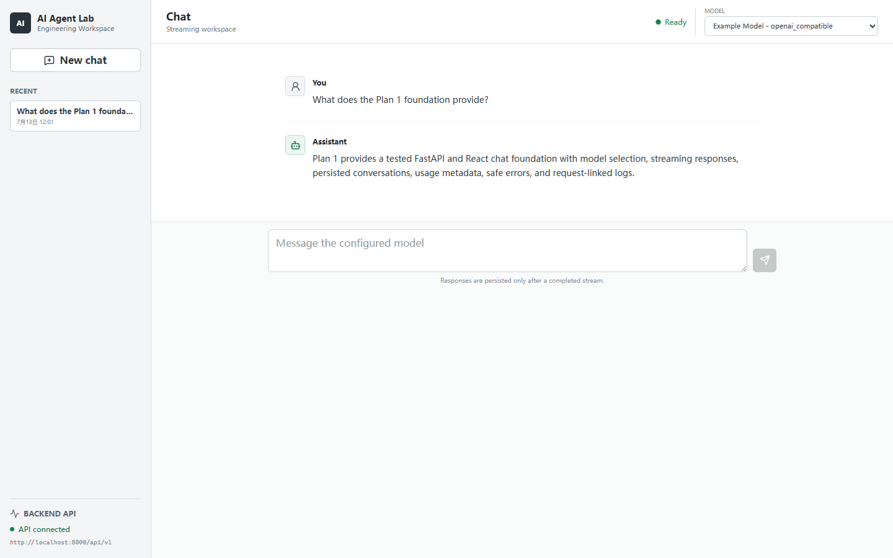
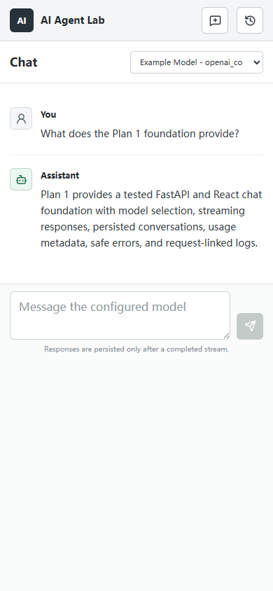
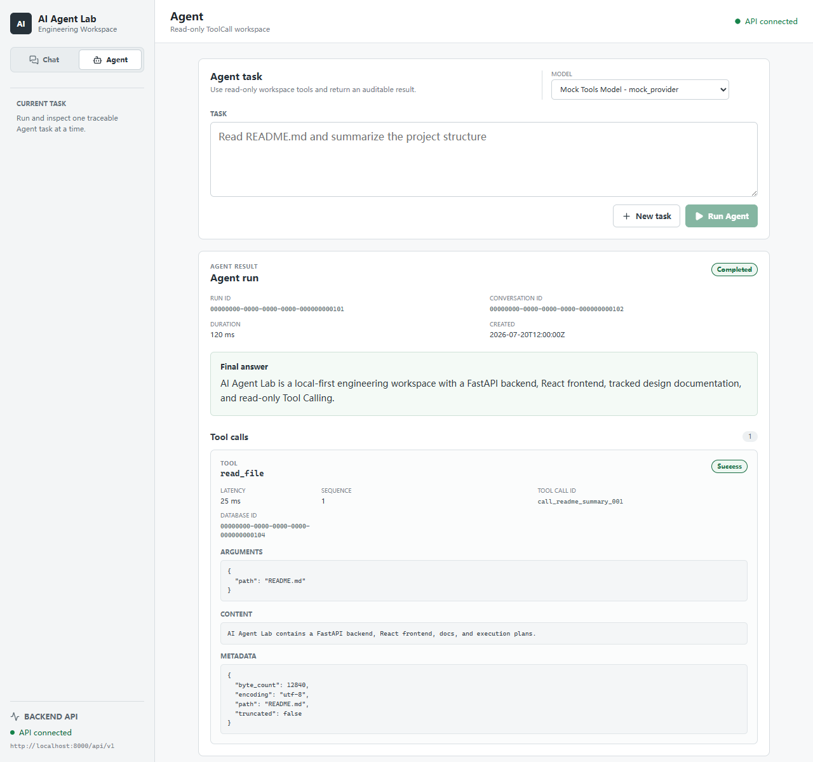
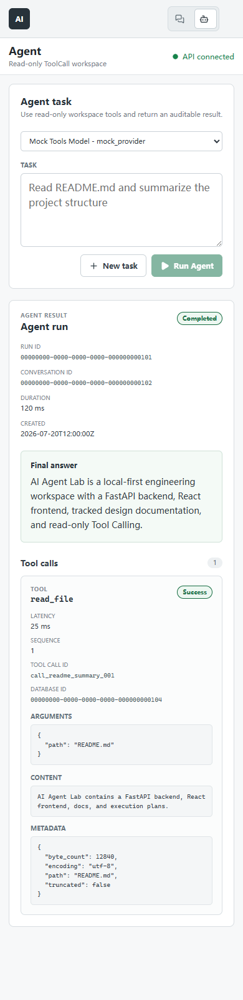

# AI Agent Lab

[English](README.md) | [中文](README_CN.md)

AI Agent Lab 是一个分阶段构建的 AI Engineering Workspace，用来学习和实践现代 AI 应用背后的核心系统。项目从稳定的 FastAPI + React 工程底座开始，逐步扩展到 Chat、Provider 抽象、Tool Calling、RAG、Trace、Memory、Agent Runtime、MCP、Voice、Vision 和 Desktop 工作流。

这个仓库不是一组互不相干的 Demo。目标是按计划一步一步构建一个可使用、可观测、可测试、可扩展的 AI 工程工作台。

## 当前阶段

当前最新 Git tag 是 Plan 2 审计修复补丁 `v0.2.1`，对应已发布提交
`872310b`。原始 Plan 2 基础 Agent 发布 `v0.2.0` 仍指向 `0e3f3a6`；两个既有
tag 都不得移动或改写。Plan 2 已完成。

Plan 1 覆盖：

- 项目基础骨架
- FastAPI 后端骨架
- React + TypeScript 前端骨架
- 基础健康检查
- 基础 Chat 流程
- LLM Provider 抽象
- OpenAI-compatible Provider 支持
- Streaming Chat
- 会话历史
- 基础 token、cost、latency、logging 和 error handling

已完成范围：`P1-M1-S1` 到 `P3-M4-S3`。

当前开发阶段：Plan 2 的全部里程碑、原始 `v0.2.0` 发布和 `v0.2.1` 审计补丁
都已完成，进入 Plan 3 的五项桥接契约已经重新验证。Plan 3 M1 已完成到
`P3-M1-S9`：复核发布交接、配置 Qdrant、建立明确的 RAG/Knowledge ownership
边界、新增四个知识持久化模型，并提供经过测试的后端 Knowledge Base CRUD
service/API。Plan 3 M2 首批还新增受控 multipart Document 上传、有界本地存储、
SHA-256/类型/大小校验、同一知识库去重和事务回滚文件清理。M2 第二批新增可独立
测试的 Markdown、TXT 与文本层 PDF Parser、来源 metadata，以及明确的扫描 PDF/
OCR 限制。M2 最后一批新增确定性的文本清洗、有界重叠 Chunking，以及同步的
上传到 `DocumentChunk` Pipeline，并让生命周期失败状态可见。
M3 首批新增厂商无关的异步 Embedding Provider 契约、包含 token usage 的不可变
有界批量向量结果，以及可按配置名称精确选择 Provider 实例的有序运行时 Registry。
M3 第二批新增 OpenAI-compatible `/embeddings` adapter、批量与 query 请求、安全的
HTTP/响应错误、独立延迟加载配置，以及严格的配置维度校验。
M3 第三批新增厂商无关的异步 VectorStore 契约、基于官方 Qdrant 1.15.x client 的
COSINE collection 创建/检查、向量 upsert、按知识库过滤 search、按 Document 过滤
delete，以及为 M4 保留 content 与来源 metadata 的严格 Chunk payload builder。
M3 最后一批把同步上传事务继续串联到确定性批量 Embedding 与 Qdrant upsert，将每个
Chunk UUID 持久化为 point ID，把 Document 标为 `ready` 或安全 `failed`，并在正常的
请求事务回滚时补偿删除本次 vectors。
M4 首批新增独立 Naive Vector Retriever：在外部调用前严格校验 query、知识库 UUID、
Top-K 与可选 score threshold，只生成一个 query embedding，执行按知识库隔离的
VectorStore search，并把有序命中映射为不可变、来源字段完整的 `RetrievalResult`。

M1 地基包括 Tool 与 ToolResult 契约、ToolCall 传输 schema、有序 Tool
Registry、Draft 2020-12 参数校验、只读路径策略，以及 AgentRun/ToolCall ORM
模型与 Alembic 迁移。M2 新增并注册 `read_file` 与 `list_dir` 两个只读内置
Tool，具备有界 I/O、工作区相对路径策略、敏感名称过滤、安全失败结果和 Mock
回归覆盖。`P2-M2-S7` 已完成 `web_fetch` 评估并明确延期：可信网络 Tool 需要
完整处理 SSRF、DNS/重定向、超时、响应大小、内容类型和正文提取边界。当前没有
实现、注册或暴露 `web_fetch` Tool/schema。`P2-M3-S1` 到 `P2-M3-S3` 新增
强类型非流式 Provider Tool 定义与 Tool Call、具备防御性复制的
Registry-to-Provider schema adapter，以及安全的 OpenAI-compatible `tools`
请求/响应映射。tracked 示例模型仍为 `supports_tools=false`；本批不聚合流式
Tool Call delta，因此带 tools 的流式请求会在 HTTP 前本地失败。`P2-M3-S4` 到
`P2-M3-S8` 新增仅后端可用的 Simple Agent service：可以直接回答，或运行有界
非流式循环，顺序执行 Tool Call、按 correlation ID 回填 observations，并提供
单 Tool 超时、Provider observation 上限、结构化失败结果和 AgentRun/ToolCall
审计记录。`max_steps` 默认 3、最大 10，用于限制 ToolCall 执行数；无法完整容纳的
Provider ToolCall 批次会被原子拒绝，刚好耗尽预算的运行仍可再做一次最终 Provider
决策。整个 Agent run 另有可配置总超时，且没有自动重试。tracked 模型没有声明
Tool 能力，因此需要显式的本地 tools-capable 配置才能运行此 service。
`P2-M4-S1` 到 `P2-M4-S3` 新增经过校验的 Agent 请求/响应
schema、`POST /api/v1/agents/runs` 以及 AgentRun/ToolCall 查询接口。completed 与
结构化 failed 运行都会提交并返回 HTTP 201；只读查询不会初始化 Provider 配置。
`P2-M4-S4` 到 `P2-M4-S6` 新增独立 Agent 工作台、强类型 Agent API client 和有界
ToolCall 卡片/时间线。侧栏可在 Chat 与 Agent 之间切换而不改变 Chat 流程。Agent
只列出 Registry 中 `supports_tools=true` 的模型；completed 与结构化 failed 运行
都会展示最终结果、ToolCall 审计字段和可追踪 ID。URL
`?workspace=agent&run=<uuid>` 可恢复已持久化的运行及 ToolCalls。tracked 示例模型
仍关闭 Tool 能力，因此浏览器验收只使用本地 Mock，不证明真实 Provider 连通性。
ToolCall 暴露严格的一基 `sequence_index`；UI 会截断过长参数，并只把 Provider
关联标识称为 `Tool Call ID`。POST 完成时只把 run UUID 写入当前标签页的
session storage，因此离开后重新打开 Agent 可以恢复结果，同时迟到响应不能改写
Chat URL。

`P2-M5-S1` 到 `P2-M5-S3` 加固 Tool 与 Agent 测试边界：标准 JSON 校验拒绝
非有限数，`.env*` 路径保护覆盖 `.envrc`，自动化回归锁定 `web_fetch` 没有任何
可执行表面，并使用 Mock Provider、临时 SQLite/工作区验证安全失败的 ToolCall
仍可进入 completed 最终回答。`P2-M5-S4` 到 `P2-M5-S6` 刷新前端类型、测试、
构建与本地 Mock 浏览器证据，同步当前 Tool/Agent 文档，并新增脱敏的 Plan 2
桌面端/移动端发布截图。S7～S8 已完成原始 `v0.2.0` review、release commit、
annotated tag、push 与 tag-target 门禁。

已发布的 `v0.2.1` 审计补丁新增共享的 64 KiB 标准 JSON Tool 参数上限、4096
字符内置路径上限、私钥内容识别，以及禁止 symlink/reparse traversal；`list_dir`
使用有界枚举，Agent dispatch 拒绝非只读 Tool，无效/阻止调用的参数会在持久化前
清空，Agent run 有总超时，ToolCall 顺序被严格持久化。`web_fetch` 仍然延期且没有
任何运行时表面。

Plan 3 以 `v0.2.1` 为当前基线，不会把基线降回 `v0.2.0`。

Alembic revision `20260726_0005` 新增 SQLite `knowledge_bases`、`documents`、
`document_chunks` 和 `rag_queries` 四张表。对应 ORM 与 Pydantic 契约保留知识库/
文档 ownership、摄取生命周期状态、SHA-256 hash、来源 metadata、vector ID、
检索片段快照和可选回答 Message 关联。`KnowledgeBaseService` 与五个复数形式的
`/api/v1/knowledge-bases` CRUD 路由现已提供 metadata 管理，包含部分 `PATCH`、
安全的 not-found 响应与请求级事务。嵌套 Document POST 已支持 `.md`、`.txt`
和 `.pdf` 上传，并返回同步解析、清洗和基础 Chunking 的最终结果。成功上传会
持久化有序 `DocumentChunk`，返回 `parsed` / `chunked`；预期的解析或内容失败
仍是 HTTP 201 资源，并持久化安全、可见的失败状态。VectorStore 现已能独立创建/
检查 collection，并写入、按知识库过滤检索和按 Document 删除经过校验的 Chunk point。
上传 Pipeline 现已调用配置的 Embedding Provider 与 VectorStore，持久化
`DocumentChunk.vector_id`，并在等待 Qdrant 写入完成后返回 `embedding_status=ready`；
独立 Retriever 现可返回一个知识库内有序、来源完整的 Top-K Chunks。RAG Prompt/回答
API、Document 查询/删除 API 和前端上传/RAG runtime 仍延期。
补丁 revision `20260801_0006` 增加同一知识库内的 Document hash 唯一约束，禁止
删除仍含 Document 的知识库，并在删除回答 Message 时只清空引用、保留 `RagQuery`。

## v0.1.0 演示





以上均为脱敏 Mock 演示。生成过程没有使用真实 Provider、真实 API Key 或
用户本地会话数据库。

## v0.2.0 发布演示





以上均为只使用合成 ID 的本地脱敏 Mock 演示，没有读取项目后端数据库。它们是
已发布 `v0.2.0` 的验收证据，但不证明真实 Provider Tool 能力。

## Plan 1 非目标

Plan 1 不实现：

- Tool Calling
- RAG
- Memory
- MCP
- Voice
- Vision
- Desktop app
- Multi-agent workflows

这些能力会按计划延后到后续阶段。

## 计划技术栈

- 后端：Python 3.11、FastAPI、Pydantic、SQLAlchemy、SQLite
- 前端：React、Vite、TypeScript
- LLM 接入：OpenAI-compatible providers，例如 DeepSeek 或 OpenRouter
- 测试：后端使用 pytest，前端使用 TypeScript/build 检查

本工作台以本地优先、单用户使用为主要定位。SQLite 是默认且长期支持的主数据库，
不是迁移到 PostgreSQL 之前的临时方案。SQLAlchemy 和 Alembic 用于保留合理的数据库
可移植性；只有部署或并发需求发生实质变化时，才重新评估 PostgreSQL 兼容路径。

## 仓库结构

```text
AI-Agent-Lab/
├── backend/       # FastAPI 后端，在 Plan 1 中逐步补齐
├── frontend/      # React + TypeScript 前端，在 Plan 1 中逐步补齐
├── docs/          # 已跟踪的正式项目文档和已脱敏资产
├── docs-plan/     # 已跟踪的计划源文档和执行步骤表
├── docs-local/    # 已忽略的本地草稿、私有笔记和敏感材料
├── AGENTS.md      # 根级英文协作规范
├── AGENTS_CN.md   # 根级中文协作规范
├── .env.example   # 根级环境变量示例
└── .gitignore
```

## 文档目录边界

- `docs-plan/` 存放计划源文档和执行步骤表。该目录需要提交到 Git。
- `docs/` 存放正式项目文档和已脱敏的验证资产。该目录需要提交到 Git。
- `docs-local/` 存放本地草稿、私有笔记、临时 review 材料和敏感截图。该目录会被忽略，不应提交。

## 本地开发

Plan 1 后端和前端可以分别启动。根目录 `.env.example` 只是工作区级参考，
当前后端和前端都不会自动加载它。如需本地覆盖配置，请复制各服务自己的示例：

```powershell
Copy-Item backend/.env.example backend/.env
Copy-Item frontend/.env.example frontend/.env
```

从 `backend/` 运行的后端命令读取 `backend/.env`；从 `frontend/` 运行的 Vite
命令读取 `frontend/.env`。这些本地文件必须保持未跟踪。已跟踪示例不包含真实凭据；
`VITE_*` 变量会暴露到浏览器，因此绝不能保存秘密。

### Qdrant

Plan 3 只使用 Qdrant 保存向量；SQLite 继续保存业务与审计数据，是默认且长期
支持的主数据库。从仓库根目录启动固定版本的本地服务并检查原生 health：

```powershell
docker compose up -d qdrant
Invoke-RestMethod http://localhost:6333/healthz
```

后端使用延迟加载且不含 secret 的 VectorStore 配置：

```text
QDRANT_URL=http://localhost:6333
QDRANT_COLLECTION_NAME=ai_agent_lab_chunks
QDRANT_TIMEOUT_SECONDS=10
```

只允许在未跟踪的 `backend/.env` 或进程环境中覆盖。`qdrant-client` 与服务端固定在
1.15 minor。adapter 创建一个默认 COSINE dense-vector collection；若已有 collection
的维度、距离或 named-vector 结构不同则 fail-closed。search 始终过滤
`knowledge_base_id`，Document 向量删除同时匹配 Knowledge Base 与 Document ID。
payload 保存规范 UUID、filename、chunk index、content、可选 heading/page 和嵌套来源
metadata；这些操作尚未接入上传 ingestion。

tracked Compose 配置明确禁用 Qdrant 遥测。2026-08-01 已验证固定版本
`qdrant/qdrant:v1.15.4` 容器运行、重启次数为 0，
且 `/healthz` 返回 HTTP 200 和 `healthz check passed`。该无 API key 的
Compose 服务仅用于本地开发，6333 只绑定 `127.0.0.1`，不得暴露给不受信任网络。

### Document 上传存储

后端提供一个 multipart 接口：
`POST /api/v1/knowledge-bases/{knowledge_base_id}/documents`。文件先流式写入
`backend/uploads/.staging/`，再提升为
`<knowledge_base_uuid>/<document_uuid>.<md|txt|pdf>`；SQLite 只保存相对
POSIX 路径。如需覆盖非秘密配置，可在未跟踪的 `backend/.env` 中设置：

```text
DOCUMENT_STORAGE_ROOT=./uploads
DOCUMENT_MAX_UPLOAD_BYTES=20971520
DOCUMENT_MAX_FILES_PER_KNOWLEDGE_BASE=50
DOCUMENT_MAX_PDF_PAGES=500
DOCUMENT_MAX_EXTRACTED_CHARACTERS=10000000
DOCUMENT_MAX_MARKDOWN_STRUCTURES=20000
DOCUMENT_MAX_CHUNKS=10000
RAG_CHUNK_SIZE=1000
RAG_CHUNK_OVERLAP=150
```

上传必须非空，默认上限 20 MiB，每个知识库默认最多 50 个 Document；同一
知识库按 SHA-256 拒绝重复内容，不同知识库允许相同内容。持久化路径必须严格
使用小写规范形式 `<knowledge_base_uuid>/<document_uuid>.<md|txt|pdf>`；绝对路径、
混合分隔符、点段、UUID 或后缀大小写变体都会被拒绝。正常请求回滚会删除
刚提升的文件，但进程异常终止仍可能留下孤儿文件。每个已接受上传都会在请求
提交前同步执行 Parser、Cleaner 和 Chunker。存储、数据库和非预期处理错误沿用
安全错误响应，并回滚 Document、chunk 和已提升文件。删除仍包含任意 Document
的知识库会返回 HTTP 409，并保留知识库、文档和受控文件。当前不实现 Document
删除、文件生命周期清理与孤儿扫描。runtime 上传目录已忽略，不能提交。

### Document 处理

`app.rag.parsers` 提供统一且不可变的 `ParsedDocument` 结果契约，以及独立的
Markdown、TXT 和文本层 PDF Parser。Markdown 保留原始标记，同时报告标题与围栏
代码块；代码块 metadata 只保存 `language`、`start_line` 和 `end_line`，不重复
保存代码正文。TXT 严格支持 UTF-8、UTF-8 BOM 和带 BOM 的 UTF-16；PDF 使用 `pypdf`
并保留从 1 开始的页码 metadata。扫描版或纯图片 PDF 会返回可读限制说明，因为
Plan 3 不包含 OCR。

Cleaner 会统一换行、移除受限控制/格式字符，只折叠围栏代码块外的连续空行，
完整保留围栏内部空行和 PDF 分页边界，并更新 Markdown 标题/代码块行 metadata。
Chunker 默认
使用 1000 字符窗口和 150 字符 overlap，优先选择窗口后半段的段落边界、其次
换行边界；PDF chunk 不跨页，并保留标题/页码来源。`token_count` 是确定性的
UTF-8 字节估算 `ceil(bytes / 4)`，不是 tokenizer 计费数据。默认还会拒绝超过
500 页的 PDF、超过 10,000,000 字符的提取文本、超过 20,000 项的 Markdown
结构或会产生超过 10,000 个 chunk 的文档；持久化 heading 最长 512 字符。

成功上传返回 HTTP 201，状态为 `parse_status=parsed`、
`chunk_status=chunked`、`embedding_status=ready`；每个 Chunk 都满足
`vector_id == str(chunk.id)`。编码无效或不可读内容返回 HTTP 201 的
`failed` / `failed` / `failed`；清洗后为空则返回 `parsed` / `failed` / `failed`。
Provider 或 VectorStore 失败会保留已解析/切分的 Chunk，返回
`embedding_status=failed`、固定安全消息，并保证所有 `vector_id` 为空。

上传请求仍为同步执行。Qdrant upsert 成功后会登记请求事务清理；若随后 SQLite commit
失败，系统会在关闭 Qdrant client 前 best-effort 删除该 Document 的 vectors。详见
[Document Ingestion Pipeline](docs/22-document-ingestion-pipeline.md)。

### 后端

```bash
py -3.11 -m venv .venv
cd backend
..\.venv\Scripts\python.exe -m pip install -e .[dev] --no-build-isolation
..\.venv\Scripts\python.exe -m alembic upgrade head
..\.venv\Scripts\python.exe -m uvicorn app.main:app --reload
```

后端默认数据库为 `sqlite:///./ai_agent_lab.db`。如需调整，请通过本地未跟踪的
环境变量设置 `DATABASE_URL`。数据库结构由 Alembic 管理，目前会创建
`conversations`、`messages`、`llm_calls`、`agent_runs`、`tool_calls`、
`knowledge_bases`、`documents`、`document_chunks` 和 `rag_queries`；应用启动时
不会自动建表。Plan 2 迁移还会约束 AgentRun 关联的可选用户 Message 必须属于
同一个 Conversation，并要求每个 ToolCall 具有正数、run 内唯一的
`sequence_index`。

OpenAI-compatible Provider 在初始化时读取以下可选环境变量：

```text
OPENAI_COMPATIBLE_BASE_URL=https://api.example.com/v1
OPENAI_COMPATIBLE_API_KEY=
OPENAI_COMPATIBLE_MODEL=example-model
OPENAI_COMPATIBLE_TIMEOUT_SECONDS=30
```

真实值只能放在本地未跟踪的 `.env` 或环境变量中。应用仅提供 health 流程时，
没有 API Key 也可以启动；真正初始化 Provider 时若缺少 Key，会返回可读配置错误。
Batch 5 使用 mock HTTP 测试，没有连接真实模型服务。

OpenAI-compatible Embedding Provider 使用独立的延迟加载配置：

```text
EMBEDDING_PROVIDER=openai_compatible
OPENAI_COMPATIBLE_EMBEDDING_BASE_URL=https://api.example.com/v1
OPENAI_COMPATIBLE_EMBEDDING_API_KEY=
OPENAI_COMPATIBLE_EMBEDDING_MODEL=example-embedding-model
OPENAI_COMPATIBLE_EMBEDDING_DIMENSION=1536
OPENAI_COMPATIBLE_EMBEDDING_TIMEOUT_SECONDS=30
```

具体 adapter 只在调用方请求时初始化；请求会携带配置维度，响应维度不一致会在任何
Vector Store 写入前失败。测试只使用合成凭据与 mock HTTP。模型、维度、成本、隐私和
错误处理说明见 [Embedding Provider](docs/21-embedding-provider.md)。

默认 JSON Model Registry 位于 `backend/app/providers/llm/models.json`，其中的
tracked 条目有意保持 `supports_tools=false`。如需本地 Tool-capable 模型，可把
不含 secret 的 `models.local.example.json` 复制为已忽略的 `models.local.json`，
替换合成模型标识，并在本地 `backend/.env` 设置 `MODEL_REGISTRY_PATH`：

```powershell
Copy-Item backend/app/providers/llm/models.local.example.json backend/app/providers/llm/models.local.json
```

Registry JSON 绝不保存凭据。`AGENT_RUN_TIMEOUT_SECONDS` 控制整个 Agent run 的
deadline，默认 `120`。单元测试覆盖 Registry 加载、筛选、查询、重复项检测和严格
元数据校验。Provider 与 Registry 边界见 `docs/03-llm-provider.md`。

非流式和 SSE Chat 后端流程已经建立：

```text
POST /api/v1/conversations
GET  /api/v1/conversations
GET  /api/v1/conversations/{conversation_id}
GET  /api/v1/conversations/{conversation_id}/messages
GET  /api/v1/models
POST /api/v1/chat/completions
POST /api/v1/chat/stream
```

Chat 接口只接收本轮新的用户 `content`。后端负责加载数据库会话历史、校验
Registry 模型、调用已配置 Provider，并在一个事务中写入用户消息、assistant
消息和成功的 `LLMCall`。SSE 接口先发送 `delta` 事件，再发送一个 `done`
事件；成功流在 `done` 前提交，Provider 失败或客户端取消会回滚本轮全部记录。
测试只使用 mock Provider。

新会话首个成功用户回合会在规范化空白后生成最多 50 个字符的标题。成功回合还会
记录该会话最后使用的 Registry 模型并更新活动时间。会话和消息列表接口用于最近
历史导航；失败或取消的回合不会更新这些元数据。

非流式和流式成功回合现在会把 Provider usage、基于 Registry 价格估算的 cost 和
Provider latency 写入 `LLMCall`。usage 缺失或任一 Registry 价格未知时保持
`null`，后端不会猜测数值。HTTP 与 SSE 错误使用安全的结构化 envelope，并通过
服务端生成的 `X-Request-ID` 关联日志。请求和模型调用日志包含 request ID、
provider/model、outcome 和 latency，但不记录完整消息、凭据、上游错误正文或 SQL
参数。

健康检查：

```text
GET http://localhost:8000/api/v1/health
```

预期响应：

```json
{
  "status": "ok",
  "service": "ai-agent-lab-backend"
}
```

后端验证：

```powershell
cd backend
..\.venv\Scripts\python.exe -m pytest -q
..\.venv\Scripts\python.exe -m pip check
```

### 前端

```bash
cd frontend
npm install
npm run dev
```

打开 `npm run dev` 输出的 Vite 地址。首屏是可用的 Chat 工作台，包含 API
健康状态、当前模型信息、消息状态、流式输出、Stop 和 New Chat 控件。前端读取
以下安全默认值：

```text
VITE_API_BASE_URL=http://localhost:8000/api/v1
VITE_DEFAULT_PROVIDER=openai_compatible
VITE_DEFAULT_MODEL=example-model
```

API 区域显示 `Checking API`、`API connected` 或 `API unavailable`。
模型和最近会话加载期间会显示独立的工作区初始化状态；初始化失败时只显示一条
可读错误和 `Retry` 按钮，成功重试后恢复 ready 状态，不会启动自动重试循环。
工作区 ready 后，Chat 覆盖空白、会话加载、生成中、成功、已停止和错误状态。
模型选择器从 `GET /api/v1/models` 加载，侧栏显示最近会话并加载持久化消息。
当前会话写入 `?conversation=<uuid>`，刷新后会恢复其消息和最后成功使用的模型。
停止生成会在前端保留已有部分文本，但不会持久化被中断的本轮消息。迟到的历史
消息和会话列表刷新响应不会覆盖较新状态；终止 SSE 错误也会主动释放响应 reader。

通过侧栏 `Agent` 控件可进入只读 Agent 工作台。模型选择器只列出声明 Tool 能力的
Registry 模型；同步运行会展示最终回答、状态/错误、ToolCall 参数、结果摘要、耗时，
以及 AgentRun、Conversation、Provider call 和数据库 ID。运行 UUID 会写入 URL，
刷新后可重新加载已持久化的 AgentRun 与 ToolCalls。当前 UI 不提供 Agent 运行列表、
轮询、流式执行、取消/恢复或自动重试。
tracked 示例 Registry 模型会继续保持 `supports_tools=false`，因此只有本地使用者
显式配置 tools-capable Registry 条目与 Provider 后，Agent 表单才有可运行模型。
真实 Provider 凭据只能放在未跟踪的 `backend/.env` 或进程环境中，不能写入
Registry JSON 或前端 `VITE_*` 变量。

前端检查：

```powershell
cd frontend
npm run typecheck
npm run test
npm run build
```

封版文档：

- [CHANGELOG](CHANGELOG.md)
- [Plan 1 工程底座封版说明](docs/02-plan-1-foundation.md)
- [架构说明](docs/01-architecture.md)
- [LLM Provider 与 Model Registry](docs/03-llm-provider.md)
- [Tool Calling 设计](docs/10-tool-calling-design.md)
- [Simple Agent Loop](docs/11-simple-agent-loop.md)
- [Agent API](docs/12-agent-api.md)
- [Plan 2 基础 Agent 发布与补丁说明](docs/13-plan-2-basic-agent.md)
- [Knowledge Base 设计](docs/20-knowledge-base-design.md)
- [Embedding Provider](docs/21-embedding-provider.md)
- [Document Ingestion Pipeline](docs/22-document-ingestion-pipeline.md)
- [Plan 1 最终复审记录](docs/reviews/2026-07-13-plan1-v0.1.0-final-review.md)
- [Plan 2 最终复审记录](docs/reviews/2026-07-19-plan2-v0.2.0-final-review.md)
- `docs-plan/00-ALL PLAN/01-PLAN-1 (V1.0).md`
- `docs-plan/01-PLAN1/01-PLAN1-执行步骤表 (V1.0).md`

## 当前限制

封版验证只使用 Mock Provider，不能证明真实 DeepSeek/OpenRouter 已连通。
Token、预估成本和延迟保存在后端 `LLMCall` 中，但当前前端尚不展示。
当前 editable install 工作流也没有把 `models.json` 声明为未来 wheel/sdist
的 package data。Provider retry/fallback、失败调用审计记录、会话管理扩展、
Markdown 渲染以及后续 Plan 能力仍然延后。Agent 执行仍为同步非流式，不提供运行
列表、轮询、cancel/resume/retry、AgentStep/Trace replay 或真实 Provider 验收。
ToolCall 顺序已严格持久化，但 Agent Provider 调用尚未关联 `LLMCall`
usage/cost 记录，`web_fetch` 也继续明确延期且没有运行时表面。完整限制见
[Plan 1 工程底座封版说明](docs/02-plan-1-foundation.md)、
[Agent API](docs/12-agent-api.md)和
[Plan 2 发布与补丁说明](docs/13-plan-2-basic-agent.md)和
[Plan 2 最终复审记录](docs/reviews/2026-07-19-plan2-v0.2.0-final-review.md)。
Embedding Provider 验证仍只使用 Mock：尚无真实模型服务验收、自动重试/拆批或持久化
embedding 成本记录。上传到 Embedding 再到 Qdrant 的 ingestion 已有 Mock API 覆盖和
本地临时 collection smoke。独立 Retriever 已有 Mock 边界覆盖和真实临时 Qdrant
smoke，但 RAG Prompt/回答/API runtime 尚未实现；Provider usage 仍只存在于内存。
正常请求回滚会补偿 vectors，但 Qdrant 写入后进程硬崩溃仍可能留下需要后续
reconciliation 的 orphan points。

## Roadmap

- Plan 1：项目骨架 + 基础 Chat + LLM Providers
- Plan 2：Tool Calling + 简单 Agent Loop
- Plan 3：Knowledge Base + Document Ingestion + Naive RAG
- Plan 4：Trace + Advanced RAG + Rerank + Evaluation
- Plan 5：Memory + Context Engine + Agent Runtime + Human Approval
- Plan 6：MCP + Voice + Vision + Desktop
