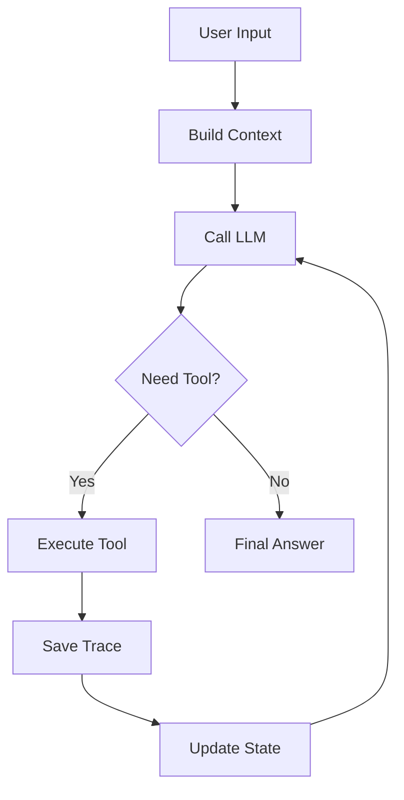
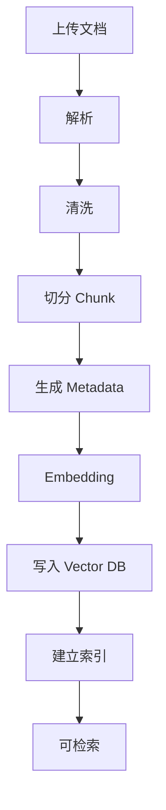
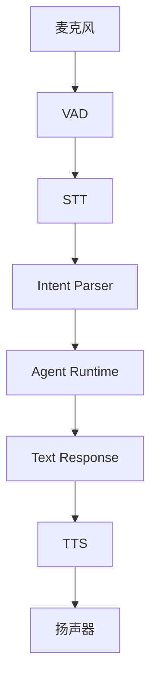
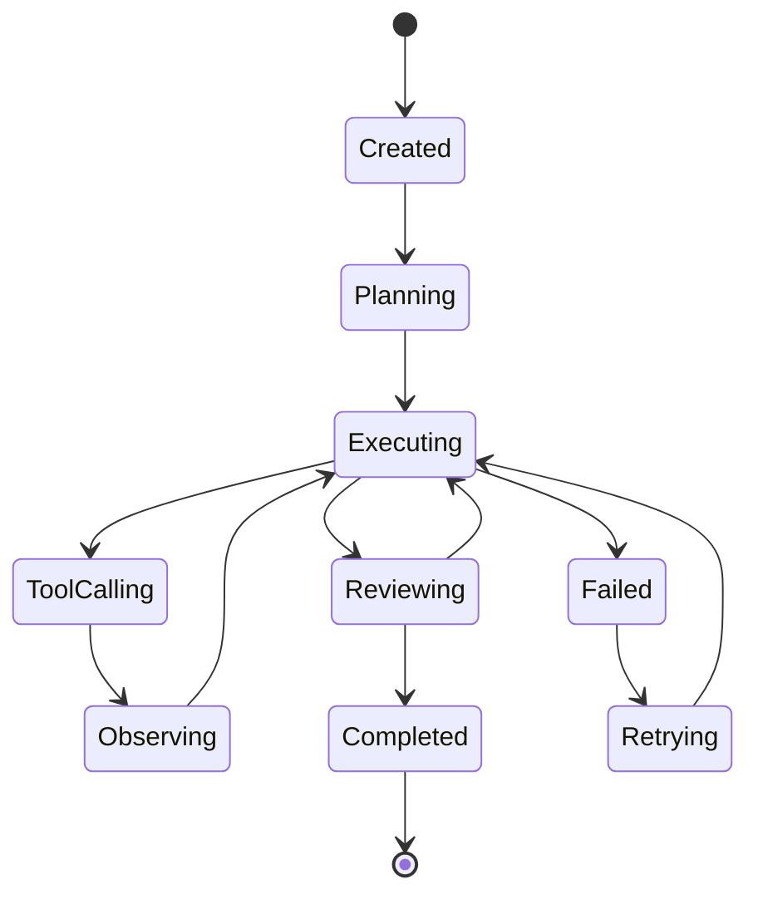

#### 阶段草稿：

| 阶段      | 阶段名称                      | 核心目标                   | 主要功能                                                                                               | 完成后效果                              | 重要程度                 | 预计投入时间（小时）    |
| ------- | ------------------------- | ---------------------- | -------------------------------------------------------------------------------------------------- | ---------------------------------- | -------------------- | ------------- |
| Phase 0 | 项目骨架                      | 把工程地基搭起来               | Git 仓库、FastAPI、React、SQLite、Docker Compose、环境变量、README、架构文档                                        | 前后端能启动，前端能调用后端健康检查                 | ⭐⭐⭐⭐                 | **25～40 h**   |
| Phase 1 | 基础 Chat + 多模型 Provider    | 实现最小 AI 对话闭环           | LLM Provider 抽象、DeepSeek/OpenRouter 接入、Chat API、流式输出、会话保存、模型选择、Token/成本统计                          | 可以做一个自己的 Web ChatGPT 雏形            | ⭐⭐⭐⭐⭐                | **50～80 h**   |
| Phase 2 | Tool Calling + 简单 Agent   | 让系统从聊天机器人变成能做事的 Agent  | Tool Registry、JSON Schema、read_file、list_dir、web_fetch、简单 Agent Loop、Tool Call 展示                  | 用户可以让 Agent 读取文件、调用工具并返回结果         | ⭐⭐⭐⭐⭐                | **60～100 h**  |
| Phase 3 | 知识库 + Naive RAG           | 实现文档问答能力               | 文件上传、Markdown/TXT/PDF 解析、Chunking、Embedding、Qdrant、向量检索、RAG Prompt、来源展示                            | 可以上传文档并基于文档问答，具备 MVP 作品集价值         | ⭐⭐⭐⭐⭐                | **80～120 h**  |
| Phase 4 | Trace + 可观测性              | 让 Agent 每一步可调试、可复盘     | Run/Step 记录、LLM 调用记录、Tool Call 记录、RAG 检索记录、Token、成本、延迟、Timeline 页面                                 | 不只是“能跑”，而是能看到为什么这样跑                | ⭐⭐⭐⭐                 | **50～80 h**   |
| Phase 5 | Advanced RAG + Evaluation | 提升知识库质量，并能量化对比         | Metadata Filtering、Hybrid Search、Parent-Child、Query Rewrite、Rerank、RAG Eval、测试集                    | 能展示 Naive RAG 和 Advanced RAG 的效果差异 | ⭐⭐⭐⭐                 | **100～150 h** |
| Phase 6 | Memory + Agent Runtime 强化 | 让 Agent 具备长期上下文和多步任务能力 | Conversation Summary、Profile Memory、Project Memory、ReAct、Planner-Executor、Human Approval、Retry、状态机 | Agent 可以处理更长任务，并记住项目背景和用户偏好        | ⭐⭐⭐⭐⭐⭐ **（内部拆的细一点）** | **120～180 h** |
| Phase 7 | MCP + 工程扩展                | 接入外部工具生态，增强可扩展性        | MCP Client、Filesystem MCP、GitHub MCP、SQLite MCP、自定义 MCP Server、权限边界                                | 项目从自带工具扩展到外部工具生态                   | ⭐⭐⭐                  | **60～100 h**  |
| Phase 8 | 语音 / 多模态 / 桌面端            | 做成更完整的 AI 工程工作台        | STT、TTS、图片上传、OCR、VLM、截图分析、Electron/Tauri、本地文件访问、快捷键、托盘                                             | 从 Web 工作台升级为可日常使用的桌面 Agent 工具      | ⭐⭐⭐（产品化阶段）           | **120～200 h** |

#### 子计划：

| 子计划                         | 对应 Phase              | 项目阶段目标                             | 完成后的成果                                                               | 预计时间          |
| --------------------------- | --------------------- | ---------------------------------- | -------------------------------------------------------------------- | ------------- |
| **Plan 1：项目基础平台**           | **Phase 0 + Phase 1** | 建立 AI Agent Lab 的工程底座，实现最小 AI 对话闭环 | 一个支持多模型、流式输出、会话保存的 AI Chat 工作台（Web）                                  | **75～120 h**  |
| **Plan 2：Agent 初版**         | **Phase 2**           | 从 Chat 升级为能够调用工具的 Agent            | Agent 能读取文件、调用工具、执行简单任务，具备最小 Agent 能力                                | **60～100 h**  |
| **Plan 3：知识库系统**            | **Phase 3**           | 构建完整 Naive RAG 系统                  | 文档上传、解析、Embedding、Qdrant、文档问答、来源引用，形成 MVP                            | **80～120 h**  |
| **Plan 4：工程化 RAG**          | **Phase 4 + Phase 5** | 建立可观测性与高质量 RAG                     | Trace、Timeline、Token 成本、Hybrid Search、Parent-Child、Rerank、Evaluation | **150～230 h** |
| **Plan 5：核心 Agent Runtime** | **Phase 6**           | 实现真正的 Agent Runtime**（要拆细致）**      | Memory、状态机、ReAct、Planner、Reflection、Human Approval、多步任务              | **120～180 h** |
| **Plan 6：Agent 工作台**        | **Phase 7 + Phase 8** | 完善 Agent 能力边界与产品形态（属于后期扩展）         | MCP、语音、多模态、桌面端，形成完整 AI Engineering Workspace                         | **180～300 h** |

#### 横向要求
这几个东西不应该单独放到最后，**每个子计划都要有**

| 横向要求      | 为什么要补                    | 从哪个阶段开始    |
| --------- | ------------------------ | ---------- |
| 基础测试      | AI 写代码容易产生隐性 bug，没有测试会失控 | Plan 1     |
| 版本封版      | 每完成一个子计划都要能回退            | Plan 1     |
| README 更新 | 项目是作品集，文档就是成果的一部分        | Plan 1     |
| API 文档    | FastAPI 自动文档要保持可用        | Plan 1     |
| 错误处理      | Provider、Tool、RAG 都会失败   | Plan 1     |
| 日志        | 没日志就无法排查问题               | Plan 1     |
| 权限边界      | Tool Calling 开始就有风险      | Plan 2     |
| Demo 截图   | 方便简历、博客、作品集沉淀            | 每个 Plan 结束 |
| 学习笔记      | 这个项目的目标是学习型参考实现          | 每个 Plan 结束 |

## 0. 项目定位

项目暂定名：

**AI Agent Lab**

副标题：

**一个覆盖 AI Agent 全技术栈的学习型参考实现项目**

一句话介绍：

> AI Agent Lab 是一个面向开发者和 AI 应用工程师的全栈 AI Agent 工程工作台。它不是为了做一个商业上多么成功的产品，而是为了通过一个完整、真实、可运行、可扩展的项目，系统性学习 AI 时代主流应用技术，包括大模型、Agent、RAG、知识库、向量数据库、工具调用、MCP、记忆机制、语音、多模态、前后端、数据库、评测、可观测性与部署工程。

核心原则：

> **业务只是载体，技术掌握才是目标。**

这个项目不追求一开始就做成 Codex、Claude Code、Cursor、OpenHands 那种成熟产品，而是做一个“可运行的 AI Agent 技术教材”和“个人高级作品集”。

它最终应该像一个简化版的：

- Codex
    
- Claude Code
    
- Cursor Agent
    
- OpenHands
    
- OpenClaw
    
- ChatGPT Projects
    
- Obsidian AI
    
- Notion AI
    
- Dify
    
- LangGraph Agent
    

但它不是复制某一个产品，而是抽象这些产品背后的共同技术结构。

---

## 1. 项目目标

### 1.1 核心目标

通过完成这个项目，尽可能系统地掌握：

- AI Agent 架构
    
- 大模型 Provider 抽象
    
- Prompt Engineering
    
- Context Engineering
    
- Harness Engineering
    
- Tool Calling
    
- MCP
    
- RAG
    
- Hybrid Search
    
- Parent-Child Retrieval
    
- Rerank
    
- Embedding
    
- Vector Database
    
- Knowledge Base
    
- Memory
    
- Workflow
    
- State Machine
    
- Multi-Agent
    
- STT
    
- TTS
    
- CV
    
- OCR
    
- VLM
    
- 多模态输入输出
    
- FastAPI 后端
    
- React / Next.js 前端
    
- Electron 桌面端
    
- 数据库设计
    
- Redis / Queue / Worker
    
- Docker 部署
    
- 日志、Tracing、Metrics
    
- Evaluation
    
- 安全与权限控制
    

### 1.2 职业目标

理想目标：

> 做完这个项目后，具备接近“高级 AI 应用工程师”的技术广度和部分技术深度。

更现实的目标：

> 做完核心版本后，至少具备中高级 AI 应用工程师 / Agent 工程师的项目经验表达能力。

更稳妥的表述：

> 这个项目不能单独让一个人真正成为 AI 架构师。AI 架构师还需要真实业务、团队协作、稳定性、成本、安全、线上事故和长期维护经验。但这个项目可以作为进入 AI 架构方向的系统训练场。

### 1.3 非目标

这个项目第一阶段不追求：

- 立刻商业化
    
- 立刻赚钱
    
- 做出完美 UI
    
- 做出比 Codex 更强的代码智能体
    
- 做出比 Claude Code 更强的终端智能体
    
- 一开始就支持全部功能
    
- 一开始就做多智能体协作
    
- 一开始就做统一记忆层
    
- 一开始就做复杂权限系统
    

项目的正确目标是：

> 先做可运行的最小闭环，再逐步扩展模块。

---

# 2. 项目业务选题

## 2.1 为什么不做普通聊天机器人

普通聊天机器人覆盖技术太窄，通常只有：

- LLM API
    
- Prompt
    
- Chat UI
    
- 简单上下文
    

它很难自然覆盖：

- RAG
    
- Tool Calling
    
- MCP
    
- Agent Runtime
    
- STT
    
- TTS
    
- Vector DB
    
- Workflow
    
- State
    
- Evaluation
    
- Observability
    
- 多模态
    
- 数据库
    
- 前后端复杂交互
    

所以这个项目不应该叫“AI 聊天助手”。

---

## 2.2 推荐业务方向：AI 工程工作台

最终业务形态：

> **AI Engineering Workspace：面向开发者、AI 应用工程师、个人创作者的 AI 工程工作台。**

它可以帮助用户完成：

1. 项目代码分析
    
2. 技术文档问答
    
3. RAG 知识库构建
    
4. 本地文件解析
    
5. Git 仓库分析
    
6. 代码修改建议
    
7. Bug 定位
    
8. 语音控制智能体
    
9. 会议 / 录音转写
    
10. 图片 / 截图 / UI 分析
    
11. 多模型对比
    
12. 项目长期记忆
    
13. 自动生成学习笔记
    
14. 自动生成技术报告
    
15. 自动生成任务计划
    
16. 调用外部工具
    
17. 执行本地脚本
    
18. 查询数据库
    
19. 通过 MCP 接入外部工具
    
20. 对 Agent 输出进行评测和追踪
    

这个业务场景足够真实，也足够开放，能自然容纳 AI 时代的大多数主流技术。

---

# 3. 项目最终形态

## 3.1 用户视角

用户打开桌面端或网页端后，可以看到一个 AI 工作台。

核心页面包括：

- Chat 页面
    
- Knowledge Base 页面
    
- Agent 页面
    
- Tools 页面
    
- Workflow 页面
    
- Memory 页面
    
- Evaluation 页面
    
- Observability 页面
    
- Settings 页面
    

用户可以：

- 上传 PDF / Markdown / Word / Excel / 图片
    
- 导入 Git 仓库
    
- 创建知识库
    
- 选择模型
    
- 选择 Embedding
    
- 选择向量数据库
    
- 配置 STT / TTS
    
- 通过文字或语音提问
    
- 让 Agent 调用工具
    
- 查看 Agent 执行轨迹
    
- 查看 RAG 命中的文档片段
    
- 查看 token 成本
    
- 查看每一步执行状态
    
- 保存长期记忆
    
- 评估回答质量
    

---

## 3.2 技术视角

项目本质是一个：

> **可插拔的 AI Agent Framework + 工程工作台**

核心不是 UI，而是后端的 Agent Runtime。

---

# 4. 总体架构图

```mermaid
flowchart TD
    User[用户] --> UI[前端界面 Web / Desktop / Mobile]

    UI --> Input[输入层]
    Input --> TextInput[文字输入]
    Input --> VoiceInput[语音输入 STT]
    Input --> ImageInput[图片 / 截图 / OCR]
    Input --> FileInput[文件上传]
    Input --> RepoInput[Git 仓库导入]

    TextInput --> Backend[FastAPI Backend]
    VoiceInput --> Backend
    ImageInput --> Backend
    FileInput --> Backend
    RepoInput --> Backend

    Backend --> Session[Session Manager]
    Backend --> AgentRuntime[Agent Runtime]

    AgentRuntime --> ContextEngine[Context Engine]
    AgentRuntime --> Planner[Planner]
    AgentRuntime --> ToolManager[Tool Manager]
    AgentRuntime --> ModelRouter[Model Router]
    AgentRuntime --> Memory[Memory System]
    AgentRuntime --> RagSystem[RAG System]
    AgentRuntime --> Workflow[Workflow / State Machine]

    ContextEngine --> Prompt[Prompt Templates]
    ContextEngine --> History[Conversation History]
    ContextEngine --> ProjectContext[Project Context]

    RagSystem --> Parser[Document Parser]
    RagSystem --> Chunker[Chunker]
    RagSystem --> Embedding[Embedding Provider]
    RagSystem --> VectorDB[Vector Database]
    RagSystem --> Reranker[Reranker]
    RagSystem --> Retriever[Retriever]

    ToolManager --> BuiltinTools[Built-in Tools]
    ToolManager --> MCP[MCP Client]
    ToolManager --> Shell[Shell Tool]
    ToolManager --> Python[Python Tool]
    ToolManager --> Browser[Browser Tool]
    ToolManager --> Git[Git Tool]
    ToolManager --> DBTool[Database Tool]

    ModelRouter --> OpenAI[OpenAI]
    ModelRouter --> DeepSeek[DeepSeek]
    ModelRouter --> Claude[Anthropic Claude]
    ModelRouter --> Gemini[Google Gemini]
    ModelRouter --> Qwen[Qwen]
    ModelRouter --> LocalLLM[Local LLM]
    ModelRouter --> OpenRouter[OpenRouter]

    Memory --> ShortMemory[短期记忆]
    Memory --> LongMemory[长期记忆]
    Memory --> ProfileMemory[用户画像]
    Memory --> EpisodicMemory[事件记忆]
    Memory --> SemanticMemory[语义记忆]

    AgentRuntime --> Eval[Evaluation]
    AgentRuntime --> Obs[Observability]

    Eval --> TestSet[Test Dataset]
    Eval --> Judge[LLM as Judge]
    Eval --> Metrics[Metrics]

    Obs --> Logs[Logs]
    Obs --> Traces[Traces]
    Obs --> Cost[Token Cost]
    Obs --> Replay[Replay]

    Backend --> Storage[(PostgreSQL / SQLite)]
    Backend --> Redis[(Redis)]
    Backend --> Queue[Task Queue]
```



---

# 5. 技术模块总览

## 5.1 前端模块

推荐技术：

- React
    
- Next.js
    
- Tailwind CSS
    
- shadcn/ui
    
- Zustand / Redux
    
- React Query
    
- Monaco Editor
    
- Mermaid Renderer
    
- Markdown Renderer
    
- WebSocket / SSE
    
- Electron
    

需要实现：

1. Chat UI
    
2. 模型选择器
    
3. Agent 选择器
    
4. 文件上传
    
5. 知识库管理
    
6. RAG 命中片段展示
    
7. Agent 执行步骤展示
    
8. Tool Call 展示
    
9. Trace Timeline
    
10. Memory 查看与编辑
    
11. Evaluation 面板
    
12. Settings 配置页
    
13. Token 成本展示
    
14. 语音输入按钮
    
15. TTS 播放按钮
    

学习价值：

- 前端工程化
    
- AI Chat UI
    
- 流式输出
    
- Markdown 渲染
    
- 代码高亮
    
- 状态管理
    
- WebSocket / SSE
    
- 文件上传
    
- 大型单页应用结构
    

---

## 5.2 后端模块

推荐技术：

- Python
    
- FastAPI
    
- Pydantic
    
- SQLAlchemy
    
- Alembic
    
- PostgreSQL
    
- SQLite
    
- Redis
    
- Celery / RQ / Dramatiq
    
- WebSocket / SSE
    
- Docker
    
- Uvicorn / Gunicorn
    

需要实现：

1. 用户会话管理
    
2. Chat API
    
3. Streaming API
    
4. Agent Run API
    
5. 文件上传 API
    
6. 知识库 API
    
7. 文档解析任务 API
    
8. Embedding 任务 API
    
9. RAG 检索 API
    
10. Tool 调用 API
    
11. Memory API
    
12. Evaluation API
    
13. Trace API
    
14. Provider 配置 API
    
15. Worker 异步任务
    

学习价值：

- API 设计
    
- 异步任务
    
- 后端分层架构
    
- 数据库建模
    
- 文件存储
    
- 流式输出
    
- 长任务状态管理
    
- AI 后端工程
    

---

# 6. 核心模块设计

## 6.1 LLM Provider 抽象

目标：

> 不绑定任何一家模型厂商。

支持 Provider：

- OpenAI
    
- Anthropic
    
- Google Gemini
    
- DeepSeek
    
- Qwen
    
- OpenRouter
    
- Ollama
    
- vLLM
    
- LM Studio
    
- 自定义 OpenAI-Compatible API
    

统一接口示例：

```python
class LLMProvider:
    async def chat(
        self,
        messages: list[dict],
        tools: list[dict] | None = None,
        stream: bool = False,
        response_format: dict | None = None,
        temperature: float = 0.7,
        max_tokens: int | None = None,
    ) -> LLMResponse:
        ...
```

需要学习：

- Chat Completion
    
- Responses API
    
- Streaming
    
- Function Calling
    
- Tool Calling
    
- Structured Output
    
- JSON Schema
    
- Token 统计
    
- 模型路由
    
- 失败重试
    
- 限流处理
    
- 成本计算
    
- 缓存命中设计
    

实现目标：

- 同一套 Agent Runtime 可以切换不同模型
    
- 支持模型 fallback
    
- 支持低成本模型和高能力模型分层
    
- 支持模型能力标签
    

模型能力标签示例：

```yaml
models:
  deepseek-chat:
    provider: deepseek
    supports_tools: true
    supports_json: true
    supports_vision: false
    cost_level: low
    best_for:
      - coding
      - reasoning
      - chinese

  gpt-4.1:
    provider: openai
    supports_tools: true
    supports_json: true
    supports_vision: true
    cost_level: high
    best_for:
      - agent
      - tool_calling
      - multimodal
```

---

## 6.2 Agent Runtime

Agent Runtime 是项目核心。

它负责：

1. 接收用户输入
    
2. 构造上下文
    
3. 调用模型
    
4. 解析模型输出
    
5. 执行工具
    
6. 更新状态
    
7. 记录轨迹
    
8. 判断是否继续循环
    
9. 输出最终结果
    

核心流程：



需要实现的 Agent 模式：

### 1. Single-turn Agent

最简单：

```text
输入 → LLM → 输出
```

### 2. Tool-using Agent

```text
输入 → LLM 判断工具 → 调用工具 → LLM 总结 → 输出
```

### 3. ReAct Agent

```text
Thought → Action → Observation → Thought → Action → Observation → Final
```

### 4. Planner-Executor Agent

```text
用户任务 → Planner 拆解任务 → Executor 执行每一步 → 汇总
```

### 5. Reflection Agent

```text
生成答案 → 自我检查 → 修正 → 输出
```

### 6. Multi-Agent

后期再做：

```text
Planner Agent
Research Agent
Coding Agent
Critic Agent
Summary Agent
```

学习价值：

- Agent Loop
    
- 状态机
    
- 工具调用
    
- 多步推理
    
- 错误恢复
    
- 执行轨迹
    
- 任务分解
    
- 反思修正
    

---

## 6.3 Context Engine

目标：

> 管理模型每次应该看到什么。

上下文来源：

1. System Prompt
    
2. Developer Prompt
    
3. 用户输入
    
4. 历史消息
    
5. RAG 检索结果
    
6. Memory
    
7. Tool Result
    
8. 文件内容
    
9. 项目信息
    
10. Agent 状态
    
11. 用户偏好
    
12. 当前任务计划
    

需要实现：

- Token 预算管理
    
- 长上下文裁剪
    
- 消息压缩
    
- 历史摘要
    
- RAG 注入
    
- Memory 注入
    
- 工具描述注入
    
- Few-shot 示例注入
    
- 固定前缀优化
    
- Prompt Cache 友好结构
    

推荐上下文结构：

```text
[System Prompt - 固定]
[Agent Role - 固定]
[Tool Definitions - 尽量固定]
[Project Context - 低频变化]
[User Profile Memory - 低频变化]
[Relevant Long-term Memory - 检索注入]
[RAG Context - 检索注入]
[Conversation Summary - 动态]
[Recent Messages - 动态]
[Current User Input - 每次变化]
```

学习价值：

- Prompt Engineering
    
- Context Engineering
    
- Token Budget
    
- Prompt Cache
    
- Long Context
    
- Memory Injection
    
- RAG Context Formatting
    

---

## 6.4 Tool Calling 系统

工具是 Agent 从“会说话”变成“能做事”的关键。

内置工具建议：

### 文件工具

- read_file
    
- write_file
    
- list_dir
    
- search_file
    
- create_file
    
- delete_file
    

### Shell 工具

- run_command
    
- run_script
    
- check_process
    

### Python 工具

- execute_python
    
- run_notebook_cell
    
- data_analysis
    

### Git 工具

- git_status
    
- git_diff
    
- git_log
    
- git_branch
    
- git_commit
    

### Web 工具

- web_search
    
- fetch_url
    
- browser_open
    
- browser_extract
    

### 数据库工具

- sql_query
    
- sql_schema
    
- sql_insert
    
- sql_update
    

### RAG 工具

- retrieve_documents
    
- search_knowledge_base
    
- rerank_results
    

### 项目工具

- analyze_repo
    
- summarize_module
    
- generate_readme
    
- generate_test_case
    

工具定义示例：

```python
class Tool:
    name: str
    description: str
    parameters_schema: dict
    permission_level: str
    timeout: int

    async def run(self, arguments: dict) -> ToolResult:
        ...
```

需要重点学习：

- Tool Schema
    
- JSON Schema
    
- 参数校验
    
- 工具权限
    
- 工具超时
    
- 工具失败重试
    
- 工具结果压缩
    
- 工具执行日志
    
- 工具沙箱
    
- 人类审批
    

---

## 6.5 MCP 模块

MCP 是 Agent 连接外部工具和数据源的重要协议。

第一阶段目标：

- 做 MCP Client
    
- 接入本地 MCP Server
    
- 调用 MCP Tools
    

后续目标：

- 自己实现一个 MCP Server
    
- 把项目内部能力暴露给其他 Agent
    

推荐接入：

- Filesystem MCP
    
- GitHub MCP
    
- Browser MCP
    
- SQLite MCP
    
- PostgreSQL MCP
    
- Obsidian MCP
    
- 自定义项目 MCP
    

学习目标：

- MCP Client
    
- MCP Server
    
- Tool Discovery
    
- Resource Discovery
    
- Prompt Discovery
    
- 外部工具协议
    
- 权限边界
    
- 工具安全
    

---

# 7. RAG 与知识库系统

## 7.1 知识库不是 RAG

知识库包括：

- 原始文档
    
- 解析结果
    
- Chunk
    
- Metadata
    
- Embedding
    
- Vector Index
    
- Keyword Index
    
- Graph
    
- 文档版本
    
- 权限
    
- 检索器
    
- 评测集
    

RAG 是使用知识库的一种方法：

```text
用户问题 → 检索知识库 → 将检索结果注入上下文 → LLM 回答
```

---

## 7.2 文档接入类型

第一阶段：

- Markdown
    
- TXT
    
- PDF
    
- Word
    
- Excel
    
- CSV
    

第二阶段：

- HTML
    
- 网页
    
- GitHub Repo
    
- 图片
    
- 截图
    
- PPT
    

第三阶段：

- 视频
    
- 音频
    
- 数据库
    
- API
    
- Notion
    
- Obsidian Vault
    

---

## 7.3 文档处理 Pipeline



每一步都要记录：

- 文档 ID
    
- 版本
    
- 文件名
    
- 文件类型
    
- 页码
    
- 标题
    
- Chunk ID
    
- Parent ID
    
- Token 数
    
- Metadata
    
- Embedding 模型
    
- 处理时间
    
- 是否成功
    
- 错误信息
    

---

## 7.4 RAG 策略

需要逐步实现以下 RAG：

### 1. Naive RAG

最基础：

```text
Query → Embedding → Vector Search → TopK → LLM
```

学习目标：

- Embedding
    
- Vector Search
    
- TopK
    
- Context 注入
    

---

### 2. Metadata Filtering RAG

通过元数据过滤：

```text
只检索 project = VoiceControl 的文档
只检索 type = API_DOC 的文档
只检索 date > 2026-01-01 的文档
```

学习目标：

- Metadata 设计
    
- Filter
    
- 权限隔离
    
- 多知识库隔离
    

---

### 3. Hybrid RAG

结合：

- Dense Vector Search
    
- Sparse Vector Search
    
- BM25
    
- Keyword Search
    

学习目标：

- 语义检索
    
- 关键词检索
    
- 混合召回
    
- 分数融合
    
- RRF
    

---

### 4. Parent-Child RAG

小块检索，大块返回。

适合：

- PDF
    
- 长文档
    
- 技术文档
    
- 书籍
    
- 方案文档
    

学习目标：

- 多粒度 Chunk
    
- Parent Node
    
- Child Node
    
- Small-to-Big Retrieval
    

---

### 5. Sentence Window RAG

命中句子后，返回前后若干句。

适合：

- 法律
    
- 合同
    
- 精确问答
    
- 论文
    

---

### 6. Query Rewrite

先改写用户问题，再检索。

适合：

- 用户问题不清晰
    
- 口语化输入
    
- 语音输入
    
- 中文英文混合输入
    

---

### 7. HyDE

先让 LLM 生成一个假想答案，再用假想答案检索。

适合：

- 问题表达很差
    
- 资料术语和用户表达差异较大
    

---

### 8. RAG Fusion

生成多个查询，从多个角度检索，再融合结果。

适合：

- 复杂问题
    
- 宽泛问题
    
- 研究型问题
    

---

### 9. Rerank RAG

先召回 30 条，再用 reranker 选出最相关 5 条。

学习目标：

- Cross-Encoder Rerank
    
- BGE Reranker
    
- Jina Reranker
    
- Qwen Reranker
    
- 召回与精排分离
    

---

### 10. Agentic RAG

Agent 自己判断：

- 是否需要检索
    
- 检索哪个知识库
    
- 检索几次
    
- 是否需要改写 Query
    
- 是否需要补充检索
    

学习目标：

- RAG Tool
    
- Agent Planner
    
- Multi-step Retrieval
    
- 迭代检索
    

---

### 11. GraphRAG

从文档中抽取实体和关系，形成知识图谱。

适合：

- 人物关系
    
- 公司组织
    
- 世界观设定
    
- 项目依赖
    
- 复杂业务规则
    

学习目标：

- Entity Extraction
    
- Relation Extraction
    
- Knowledge Graph
    
- Graph Query
    
- 图谱 + RAG
    

---

## 7.5 Embedding Provider

支持：

- OpenAI Embedding
    
- Qwen Embedding
    
- BGE
    
- Jina Embeddings
    
- Voyage
    
- 本地 sentence-transformers
    

统一接口：

```python
class EmbeddingProvider:
    async def embed_texts(self, texts: list[str]) -> list[list[float]]:
        ...

    async def embed_query(self, query: str) -> list[float]:
        ...
```

需要学习：

- 向量维度
    
- 归一化
    
- 批量 embedding
    
- 多语言 embedding
    
- 中文 embedding
    
- 成本控制
    
- embedding 版本迁移
    

---

## 7.6 Vector Database

优先支持顺序：

### 第一阶段：Qdrant

适合个人项目。

学习：

- Collection
    
- Point
    
- Payload
    
- Dense Vector
    
- Sparse Vector
    
- Filter
    
- Hybrid Search
    
- Docker 部署
    

### 第二阶段：pgvector

适合和 PostgreSQL 合并。

学习：

- SQL + Vector
    
- 简化部署
    
- 结构化数据 + 向量数据
    

### 第三阶段：Milvus

适合大规模和企业场景。

学习：

- 分布式向量数据库
    
- Collection
    
- Index
    
- Partition
    
- Hybrid Search
    

### 第四阶段：Chroma / FAISS

适合 Demo 和本地实验。

---

# 8. Memory 记忆系统

## 8.1 Memory 不等于 RAG

RAG 通常面向外部知识。

Memory 面向用户、会话、项目和历史经验。

Memory 应包括：

- 短期记忆
    
- 长期记忆
    
- 用户画像
    
- 项目记忆
    
- 事件记忆
    
- 语义记忆
    
- 偏好记忆
    
- 任务记忆
    

---

## 8.2 Memory 类型

### 1. Short-term Memory

当前会话上下文。

存储：

- 最近消息
    
- 当前任务
    
- 当前 Agent 状态
    

实现：

- Redis
    
- PostgreSQL
    
- 内存对象
    

---

### 2. Conversation Summary Memory

当对话太长时，自动总结。

实现：

- 定期摘要
    
- 滚动摘要
    
- 分层摘要
    

---

### 3. Profile Memory

用户长期偏好。

示例：

```json
{
  "language": "zh-CN",
  "preferred_style": "direct",
  "favorite_tools": ["Python", "FastAPI", "Qdrant"],
  "career_goal": "AI应用工程师"
}
```

实现：

- JSON
    
- PostgreSQL
    
- 可人工编辑
    

---

### 4. Episodic Memory

事件记忆。

示例：

```text
2026-06-29：用户决定将 VoiceControl 第一阶段定位为语音操作多个智能体。
```

实现：

- PostgreSQL
    
- VectorDB
    
- 时间线
    

---

### 5. Semantic Memory

抽象知识记忆。

示例：

```text
VoiceControl 是用户自己的项目。
Hermes 是开源智能体，不是用户自己的项目。
星网是用户未来规划中的统一智能体控制层。
```

实现：

- VectorDB
    
- Knowledge Graph
    
- Structured DB
    

---

### 6. Task Memory

任务状态记忆。

示例：

```json
{
  "task_id": "task_001",
  "goal": "实现 SenseVoice STT Provider",
  "status": "in_progress",
  "current_step": "封装统一 STT 接口"
}
```

实现：

- PostgreSQL
    
- Redis
    
- State Machine
    

---

## 8.3 Memory 写入策略

不要什么都记。

记忆写入应经过判断：

```text
用户说了一句话
    ↓
Memory Classifier
    ↓
是否长期有价值？
    ↓
是否敏感？
    ↓
是否已存在？
    ↓
是否需要用户确认？
    ↓
写入 Memory
```

Memory 写入标准：

- 长期稳定
    
- 会影响未来回答
    
- 对项目有帮助
    
- 对用户偏好有帮助
    
- 不是短期情绪垃圾
    
- 不是敏感隐私，除非用户明确要求
    

---

# 9. 语音系统

## 9.1 STT

本地 STT：

- SenseVoice-Small
    
- Whisper-small
    
- Whisper-medium
    

API STT：

- OpenAI STT
    
- 阿里云 ASR
    
- 火山引擎 ASR
    
- 腾讯云 ASR
    
- Deepgram
    

统一接口：

```python
class STTProvider:
    async def transcribe(self, audio: bytes, language: str | None = None) -> STTResult:
        ...
```

需要学习：

- 音频采集
    
- VAD
    
- 端点检测
    
- 流式识别
    
- 文件识别
    
- 中文识别
    
- 中英混合识别
    
- 标点恢复
    
- 说话人分离
    
- 热词
    
- 延迟优化
    

---

## 9.2 TTS

本地 TTS：

- Edge TTS
    
- CosyVoice
    
- FishSpeech
    

API TTS：

- OpenAI TTS
    
- 火山 TTS
    
- 阿里云 TTS
    
- ElevenLabs
    

统一接口：

```python
class TTSProvider:
    async def synthesize(self, text: str, voice: str, speed: float = 1.0) -> bytes:
        ...
```

需要学习：

- 文本转语音
    
- 流式 TTS
    
- 声音选择
    
- 语速控制
    
- 情绪控制
    
- 音频播放
    
- 语音打断
    

---

## 9.3 Voice Agent Pipeline



第一阶段目标：

> 语音输入，转文字，交给 Agent，输出文字。

第二阶段目标：

> 加 TTS，让 Agent 语音回答。

第三阶段目标：

> 支持流式语音对话和打断。

---

# 10. 多模态系统

## 10.1 图片理解

支持：

- 图片上传
    
- 截图分析
    
- UI 分析
    
- OCR
    
- 图表理解
    
- 表格识别
    
- 图片问答
    

可用模型：

- GPT-4o / GPT-5 系列视觉能力
    
- Gemini Vision
    
- Qwen-VL
    
- InternVL
    
- OCR 模型
    

学习目标：

- 图片预处理
    
- OCR
    
- VLM 调用
    
- 图片 + 文本联合输入
    
- Bounding Box
    
- UI 元素识别
    
- 图表理解
    
- 文档版面分析
    

---

## 10.2 文档多模态解析

PDF 不只是文本。

需要处理：

- 文字
    
- 表格
    
- 图片
    
- 页眉页脚
    
- 页码
    
- 图注
    
- 表格标题
    
- 布局结构
    

学习目标：

- PDF Parser
    
- OCR
    
- Layout Analysis
    
- Table Extraction
    
- Markdown 转换
    
- 文档结构化
    

---

## 10.3 视频 / 音频

后期支持：

- 视频转文字
    
- 视频关键帧提取
    
- 视频摘要
    
- 音频转写
    
- 会议总结
    

学习目标：

- FFmpeg
    
- Audio Segmentation
    
- Keyframe Extraction
    
- ASR
    
- Multimodal Summary
    

---

# 11. Workflow 与状态机

Agent 不能只有 while loop。

需要可观察、可恢复、可控制的状态机。

## 11.1 基础状态

```text
created
running
waiting_tool
waiting_user_approval
failed
retrying
completed
cancelled
```

## 11.2 Agent Run 表

字段示例：

```sql
agent_runs
- id
- user_id
- agent_id
- session_id
- goal
- status
- current_step
- input
- output
- error
- created_at
- updated_at
```

## 11.3 Step 表

```sql
agent_steps
- id
- run_id
- step_index
- step_type
- name
- input
- output
- status
- started_at
- ended_at
- latency_ms
- token_input
- token_output
- cost
```

## 11.4 Workflow 示例



学习目标：

- 状态机
    
- 长任务管理
    
- 失败恢复
    
- 审批节点
    
- 多步任务
    
- 可视化执行过程
    

---

# 12. Evaluation 评测系统

没有评测，就不知道 Agent 是否真的变好了。

## 12.1 需要评测什么

### LLM 输出评测

- 是否符合格式
    
- 是否回答问题
    
- 是否有幻觉
    
- 是否遵循指令
    
- 是否引用来源
    

### RAG 评测

- Recall
    
- Precision
    
- MRR
    
- Context Precision
    
- Context Recall
    
- Faithfulness
    
- Answer Relevancy
    

### Tool Calling 评测

- 是否选对工具
    
- 参数是否正确
    
- 是否执行成功
    
- 是否处理错误
    

### Agent 任务评测

- 是否完成目标
    
- 步骤是否合理
    
- 成本是否可接受
    
- 延迟是否可接受
    
- 是否有危险行为
    

---

## 12.2 评测数据集

需要建立自己的测试集。

示例：

```yaml
- id: rag_001
  question: "VoiceControl 第一阶段目标是什么？"
  expected_sources:
    - "docs/voicecontrol/roadmap.md"
  expected_answer_contains:
    - "语音操作多个智能体"

- id: tool_001
  task: "读取 README.md 并总结项目结构"
  expected_tool:
    - "read_file"
  expected_success: true
```

---

## 12.3 评测方式

1. Rule-based
    
2. Exact Match
    
3. Regex
    
4. LLM-as-Judge
    
5. Human Review
    
6. Golden Dataset
    
7. Regression Test
    
8. A/B Test
    

---

# 13. Observability 可观测性

Agent 系统必须能追踪每一步。

## 13.1 需要记录什么

- 用户输入
    
- 最终输出
    
- 使用了哪个模型
    
- 输入 token
    
- 输出 token
    
- 成本
    
- 延迟
    
- RAG 检索结果
    
- Rerank 分数
    
- Tool Call 参数
    
- Tool Call 结果
    
- 错误堆栈
    
- Agent 状态变化
    
- Memory 写入记录
    
- Prompt 版本
    
- Provider 版本
    

---

## 13.2 Trace 示例

```text
Run #123
├── Step 1: Build Context
├── Step 2: Call LLM
├── Step 3: Tool Call: search_knowledge_base
├── Step 4: Rerank
├── Step 5: Call LLM
└── Step 6: Final Answer
```

---

## 13.3 可观测性页面

前端应展示：

- Timeline
    
- Token Cost
    
- Latency
    
- Tool Calls
    
- RAG Sources
    
- Error Logs
    
- Model Used
    
- Prompt Version
    
- Replay Button
    

学习目标：

- Logging
    
- Tracing
    
- Metrics
    
- Debugging
    
- Production Mindset
    

---

# 14. Security 与权限

Agent 能调用工具，就必须有安全边界。

## 14.1 权限级别

```text
level_0: 只读聊天
level_1: 读取文件
level_2: 写入文件
level_3: 执行命令
level_4: 访问网络
level_5: 修改数据库
level_6: 高风险操作，需要人工审批
```

## 14.2 高风险操作

必须确认：

- 删除文件
    
- 覆盖文件
    
- 执行 shell
    
- 安装依赖
    
- 访问外部 URL
    
- 发送邮件
    
- 提交 Git
    
- 修改数据库
    
- 调用付费 API
    

## 14.3 安全机制

需要实现：

- Tool 白名单
    
- 路径限制
    
- 命令黑名单
    
- 超时限制
    
- 沙箱目录
    
- 人工审批
    
- 操作日志
    
- API Key 加密
    
- Prompt Injection 检测
    
- MCP Server 信任等级
    

---

# 15. 数据库设计

## 15.1 核心表

```text
users
sessions
messages
agents
agent_runs
agent_steps
tools
tool_calls
documents
document_chunks
knowledge_bases
embeddings
memories
model_providers
model_usages
eval_datasets
eval_cases
eval_runs
traces
settings
```

---

## 15.2 Message 表

```sql
messages
- id
- session_id
- role
- content
- content_type
- metadata
- token_count
- created_at
```

---

## 15.3 Document 表

```sql
documents
- id
- knowledge_base_id
- filename
- file_type
- file_path
- hash
- parse_status
- metadata
- created_at
```

---

## 15.4 Chunk 表

```sql
document_chunks
- id
- document_id
- parent_id
- chunk_index
- content
- token_count
- page_number
- heading
- metadata
- vector_id
```

---

## 15.5 Memory 表

```sql
memories
- id
- user_id
- memory_type
- content
- structured_data
- importance
- source
- embedding_id
- created_at
- updated_at
```

---

# 16. 推荐技术栈

## 16.1 第一版技术栈

前端：

- React
    
- Vite 或 Next.js
    
- Tailwind CSS
    
- shadcn/ui
    
- Markdown Renderer
    
- Monaco Editor
    

后端：

- Python
    
- FastAPI
    
- Pydantic
    
- SQLAlchemy
    
- SQLite
    
- Qdrant
    
- Redis
    
- Celery 或 RQ
    

AI：

- OpenAI-compatible Provider
    
- DeepSeek
    
- OpenRouter
    
- Qwen / BGE Embedding
    
- SenseVoice-Small
    
- Edge TTS
    

部署：

- Docker Compose
    
- 本地 Windows + WSL
    
- Linux VPS
    

---

## 16.2 第二版技术栈

增加：

- PostgreSQL
    
- pgvector
    
- Milvus
    
- LangGraph
    
- MCP Client
    
- OpenTelemetry
    
- RAGAS / DeepEval
    
- Electron
    
- MinIO
    

---

# 17. 项目目录结构

```text
ai-agent-lab/
├── README.md
├── docker-compose.yml
├── .env.example
├── docs/
│   ├── 00-project-overview.md
│   ├── 01-architecture.md
│   ├── 02-agent-runtime.md
│   ├── 03-rag.md
│   ├── 04-memory.md
│   ├── 05-tools.md
│   ├── 06-mcp.md
│   ├── 07-audio.md
│   ├── 08-vision.md
│   ├── 09-evaluation.md
│   └── 10-deployment.md
│
├── backend/
│   ├── app/
│   │   ├── main.py
│   │   ├── api/
│   │   ├── core/
│   │   ├── db/
│   │   ├── models/
│   │   ├── schemas/
│   │   ├── services/
│   │   ├── agents/
│   │   ├── providers/
│   │   │   ├── llm/
│   │   │   ├── embedding/
│   │   │   ├── stt/
│   │   │   ├── tts/
│   │   │   ├── rerank/
│   │   │   └── vectorstore/
│   │   ├── rag/
│   │   ├── memory/
│   │   ├── tools/
│   │   ├── mcp/
│   │   ├── workflows/
│   │   ├── evaluation/
│   │   ├── observability/
│   │   └── security/
│   └── tests/
│
├── frontend/
│   ├── src/
│   │   ├── pages/
│   │   ├── components/
│   │   ├── features/
│   │   ├── stores/
│   │   ├── api/
│   │   └── utils/
│   └── package.json
│
├── workers/
│   ├── document_worker.py
│   ├── embedding_worker.py
│   ├── eval_worker.py
│   └── audio_worker.py
│
├── examples/
│   ├── rag_demo/
│   ├── tool_calling_demo/
│   ├── memory_demo/
│   ├── mcp_demo/
│   └── voice_agent_demo/
│
└── scripts/
    ├── init_db.py
    ├── ingest_docs.py
    ├── run_eval.py
    └── start_dev.sh
```

---

# 18. 分阶段路线图

## Phase 0：项目骨架

目标：

> 搭建基础工程结构。

任务：

- 建立 Git 仓库
    
- 搭建 FastAPI
    
- 搭建 React
    
- 配置 Docker Compose
    
- 配置 SQLite / PostgreSQL
    
- 配置环境变量
    
- 写 README
    
- 写架构文档
    

完成标准：

- 前端能打开
    
- 后端能启动
    
- 能调用健康检查 API
    
- Docker Compose 能启动基础服务
    

---

## Phase 1：基础 Chat + 多模型 Provider

目标：

> 实现最小 AI 对话闭环。

任务：

- LLM Provider 抽象
    
- 接入 OpenAI-compatible API
    
- 接入 DeepSeek
    
- 接入 OpenRouter
    
- 实现 Chat API
    
- 实现流式输出
    
- 前端 Chat UI
    
- 保存会话和消息
    
- 统计 token 和成本
    

完成标准：

- 用户可以在前端聊天
    
- 可以切换模型
    
- 可以流式输出
    
- 消息保存到数据库
    

学习内容：

- LLM API
    
- Streaming
    
- Provider 抽象
    
- Chat UI
    
- 数据库存储
    

---

## Phase 2：Tool Calling

目标：

> 让 Agent 能调用工具。

任务：

- Tool 抽象
    
- JSON Schema 参数校验
    
- 内置 read_file 工具
    
- 内置 list_dir 工具
    
- 内置 web_fetch 工具
    
- Tool Call 执行记录
    
- 前端展示 Tool Call
    

完成标准：

- 用户问“读取 README.md 并总结”
    
- Agent 能调用 read_file
    
- 前端能看到工具调用过程
    

学习内容：

- Tool Calling
    
- Agent Loop
    
- 参数校验
    
- 工具安全
    
- 执行轨迹
    

---

## Phase 3：知识库 + Naive RAG

目标：

> 实现文档上传、解析、检索、问答。

任务：

- 文件上传
    
- Markdown / TXT 解析
    
- PDF 解析
    
- Chunking
    
- Embedding Provider
    
- Qdrant 接入
    
- Vector Search
    
- RAG Prompt
    
- RAG 来源展示
    

完成标准：

- 上传一份文档
    
- 对文档提问
    
- 回答中能看到引用片段
    

学习内容：

- RAG
    
- Embedding
    
- VectorDB
    
- Chunking
    
- 文档解析
    

---

## Phase 4：Trace + 可观测性

目标：

> 让 Agent、Tool Calling 和 RAG 的每一步都可调试、可复盘。

任务：

- Trace Run / Step 记录
    
- LLM 调用记录
    
- Tool Call 记录
    
- RAG 检索记录
    
- Token 成本统计
    
- Latency 统计
    
- Prompt Version 记录
    
- Trace Timeline 页面
    
- 错误日志与回放入口
    

完成标准：

- 每次 Chat / Agent / RAG 执行都有 trace
    
- 能看到模型调用、工具调用、检索结果、成本和延迟
    
- 前端能展示 Timeline，帮助定位问题
    

学习内容：

- Observability
    
- Tracing
    
- Metrics
    
- Token Cost
    
- Debugging
    
- Production Mindset
    

---

## Phase 5：Advanced RAG + Evaluation

目标：

> 提高 RAG 质量，并能量化对比不同检索策略的效果。

任务：

- Metadata Filtering
    
- Hybrid Search
    
- Parent-Child Retrieval
    
- Query Rewrite
    
- Rerank
    
- RAG Strategy 配置
    
- RAG Evaluation Dataset
    
- Recall / Precision / MRR
    
- Context Precision / Context Recall
    
- Faithfulness / Answer Relevancy
    
- LLM-as-Judge 初版
    

完成标准：

- 能对比 Naive RAG 和 Advanced RAG 效果
    
- 能展示不同检索策略的召回结果
    
- 有 RAG 测试集和评测指标
    
- 能发现 RAG 优化是否真的带来提升
    

学习内容：

- Hybrid Search
    
- Rerank
    
- Retrieval Evaluation
    
- RAG Optimization
    
- Evaluation
    
- Regression Test
    

---

## Phase 6：Memory + Agent Runtime 强化

目标：

> 让 Agent 具备长期上下文、多步任务、状态管理和恢复能力。

任务：

- Conversation Summary
    
- Profile Memory
    
- Project Memory
    
- Episodic Memory
    
- Semantic Memory
    
- Memory 写入判断
    
- Memory 检索注入
    
- Memory 管理页面
    
- ReAct Agent
    
- Planner-Executor
    
- Reflection
    
- State Machine
    
- Human Approval
    
- Retry
    
- Error Recovery
    
- Long-running Agent Run
    

完成标准：

- Agent 能记住用户偏好和项目背景
    
- 用户能查看、编辑、删除记忆
    
- Agent 回答时能使用相关记忆
    
- 用户给一个多步任务，Agent 能拆解、执行、总结
    
- 过程可观察、可恢复
    

学习内容：

- Memory Architecture
    
- Vector Memory
    
- Structured Memory
    
- Memory Governance
    
- Agent Pattern
    
- State Machine
    
- Workflow
    
- Long-running Task
    

---

## Phase 7：MCP + 工程扩展

目标：

> 接入外部工具生态，增强系统可扩展性。

任务：

- MCP Client
    
- 接入 Filesystem MCP
    
- 接入 GitHub MCP
    
- 接入 SQLite MCP
    
- 实现自定义 MCP Server
    
- 工具发现
    
- 外部工具权限边界
    

完成标准：

- Agent 能发现 MCP 工具
    
- Agent 能调用 MCP 工具
    
- 项目本身也能作为 MCP Server 暴露能力
    

学习内容：

- MCP 协议
    
- 工具生态
    
- 外部系统集成
    
- 权限边界
    
- 插件化架构
    

---

## Phase 8：语音 / 多模态 / 桌面端

目标：

> 从 Web 工作台升级为更完整、可日常使用的 AI 工程工作台。

任务：

- STT Provider
    
- SenseVoice-Small 本地识别
    
- Whisper 本地识别
    
- API STT
    
- TTS Provider
    
- Edge TTS
    
- 语音按钮
    
- 语音转文字后调用 Agent
    
- 图片上传
    
- OCR
    
- VLM Provider
    
- UI 截图分析
    
- 图表分析
    
- 图片 + 文本问答
    
- Electron / Tauri
    
- 本地配置
    
- 本地文件访问
    
- 系统托盘
    
- 快捷键
    
- 本地模型配置
    
- 本地知识库
    

完成标准：

- 用户可以用语音输入并获得文字或语音回答
    
- 上传截图或图片后，Agent 能进行视觉分析
    
- OCR 结果可进入 RAG
    
- Windows 上可以像普通应用一样启动
    
- 能读取本地项目文件，并通过快捷键唤出
    

学习内容：

- STT
    
- TTS
    
- VAD
    
- Audio Pipeline
    
- Voice Agent
    
- CV
    
- OCR
    
- VLM
    
- Multimodal RAG
    
- Desktop App
    
- 本地权限
    
- 前后端打包
    
- 用户体验
    

---

## Phase 9：多 Agent（后期扩展）

目标：

> 实现初级多智能体协作。

任务：

- Planner Agent
    
- Research Agent
    
- Coding Agent
    
- Critic Agent
    
- Summary Agent
    
- Agent Handoff
    
- Agent Communication
    

完成标准：

- 一个复杂任务可以由多个 Agent 协作完成
    
- 每个 Agent 职责清晰
    
- 前端能展示协作过程
    

学习内容：

- Multi-Agent
    
- Handoff
    
- Role Specialization
    
- Collaboration Protocol
    

---
# 19. 推荐学习顺序

## 第一阶段：AI 应用基础

1. Python
    
2. FastAPI
    
3. React
    
4. LLM API
    
5. Streaming
    
6. Provider 抽象
    

## 第二阶段：RAG

1. 文档解析
    
2. Chunking
    
3. Embedding
    
4. Qdrant
    
5. Naive RAG
    
6. Hybrid RAG
    
7. Rerank
    
8. RAG Eval
    

## 第三阶段：Agent

1. Tool Calling
    
2. Simple Agent Loop
    
3. ReAct
    
4. Planner
    
5. State Machine
    
6. Workflow
    
7. Error Recovery
    
8. Human Approval
    

## 第四阶段：AI 工程化 RAG

1. Observability
    
2. Trace
    
3. Metrics
    
4. Hybrid Search
    
5. Rerank
    
6. RAG Evaluation
    
7. Cost Control
    

## 第五阶段：Memory 与工程扩展

1. Memory
    
2. Agent Runtime 强化
    
3. MCP
    
4. Security
    
5. Deployment
    

## 第六阶段：多模态与语音

1. STT
    
2. TTS
    
3. OCR
    
4. Vision Model
    
5. Multimodal RAG
    
6. Voice Agent
    

## 第七阶段：架构能力

1. 模块化
    
2. 插件系统
    
3. 多模型路由
    
4. 成本控制
    
5. 权限系统
    
6. 多 Agent
    
7. 系统设计文档
    

---

# 20. 最小可行版本

如果只做 MVP，不要贪多。

MVP 只做：

1. React Chat UI
    
2. FastAPI 后端
    
3. LLM Provider
    
4. Streaming Chat
    
5. 文件上传
    
6. Markdown / PDF 解析
    
7. Qdrant
    
8. Embedding
    
9. Naive RAG
    
10. RAG 来源展示
    
11. 一个 read_file 工具
    
12. 一个简单 Agent Loop
    
13. 基础日志
    

MVP 完成后，这已经是一个可以写进简历的 AI 应用项目。

---

# 21. 简历表达方式

项目名称：

**AI Agent Lab：全栈 AI Agent 工程工作台**

简历描述：

> 设计并实现一个面向开发者的全栈 AI Agent 工程工作台，支持多模型 Provider、流式对话、Tool Calling、RAG 知识库、Embedding、向量数据库、文档解析、长期记忆、语音输入、多模态分析、Agent Workflow、MCP 工具接入、评测与可观测性。项目采用 FastAPI + React + PostgreSQL + Qdrant + Redis 架构，实现了可插拔的 LLM / Embedding / STT / TTS / VectorDB Provider 抽象，支持 DeepSeek、OpenAI-compatible、OpenRouter 等模型服务，并实现 Hybrid RAG、Parent-Child Retrieval、Rerank、Memory Injection、Agent Trace 等核心能力。

项目亮点：

- 自研 Agent Runtime，支持 Tool Calling、ReAct、Planner-Executor、状态机和执行轨迹记录。
    
- 实现 RAG 知识库系统，支持文档解析、Chunking、Embedding、Qdrant 向量检索、Hybrid Search、Rerank 和来源引用。
    
- 设计多 Provider 抽象，支持 LLM、Embedding、VectorDB、STT、TTS 的统一接入与切换。
    
- 实现 Memory 系统，支持短期记忆、长期记忆、用户画像、事件记忆和语义记忆。
    
- 接入 MCP 工具生态，实现外部工具发现与调用。
    
- 建立 Evaluation 与 Observability 模块，支持 Agent Run Trace、Token 成本统计、RAG 评测和工具调用评测。
    
- 支持语音输入、OCR、多模态图片理解等能力，探索 Voice Agent 与 Multimodal Agent 的工程实现。
    

---

# 22. 面试讲法

如果面试官问：

## 这个项目是做什么的？

回答：

> 这是一个我用来系统学习和实践 AI Agent 工程的全栈项目。它不是单纯的聊天机器人，而是一个 AI Agent 工程工作台。它包含大模型 Provider 抽象、Tool Calling、RAG、向量数据库、知识库、Memory、MCP、语音、多模态、Agent Workflow、评测和可观测性等模块。我的目标是通过这个项目完整理解现代 AI 应用从前端到后端、从模型调用到 Agent Runtime、从知识库到工程化部署的完整链路。

## 你做了哪些核心技术？

回答：

> 我主要做了五块。第一是多模型 Provider 抽象，让系统可以切换 DeepSeek、OpenAI-compatible、OpenRouter 等模型。第二是 RAG 知识库，包括文档解析、Chunking、Embedding、Qdrant、Hybrid Search 和 Rerank。第三是 Agent Runtime，包括 Tool Calling、ReAct、Planner-Executor 和状态机。第四是 Memory 系统，包括会话摘要、长期记忆、用户画像和语义记忆。第五是工程化模块，包括 Trace、Token 成本统计、Evaluation 和 Docker 部署。

## 你最大的收获是什么？

回答：

> 最大收获是理解了 AI 应用的核心不只是调用大模型，而是围绕模型构建上下文、工具、记忆、检索、状态、评测和可观测性。模型只是系统的一部分，真正决定 AI Agent 是否可用的是整个 Harness Engineering。

---

# 23. 项目风险

## 23.1 范围过大

风险：

> 想一次性做完所有功能，最后烂尾。

解决：

> 严格分阶段，每一阶段都必须有可运行 Demo。

---

## 23.2 技术太散

风险：

> 什么都碰一点，但都不深入。

解决：

> 核心模块深入：LLM Provider、Agent Runtime、RAG、Memory、Tool Calling、Evaluation。其他模块先浅后深。

---

## 23.3 变成套壳项目

风险：

> 只是调用 API，没有工程价值。

解决：

> 必须自研 Provider 抽象、Agent Runtime、RAG Pipeline、Trace、Evaluation、Memory，而不是只用现成框架拼页面。

---

## 23.4 UI 花太多时间

风险：

> 前端做得很花，但 AI 核心很弱。

解决：

> UI 够用即可，优先做后端核心。

---

## 23.5 没有文档

风险：

> 做完了但别人看不懂。

解决：

> 每个模块都写设计文档、流程图、使用示例和技术总结。

---

# 24. 最重要的设计原则

## 24.1 Provider 化

所有外部能力都做 Provider：

- LLMProvider
    
- EmbeddingProvider
    
- VectorStoreProvider
    
- STTProvider
    
- TTSProvider
    
- VisionProvider
    
- RerankProvider
    
- ToolProvider
    

这样项目不会绑定某一个模型或厂商。

---

## 24.2 模块化

每个技术模块独立：

- RAG 可以单独运行
    
- Memory 可以单独测试
    
- Tool 可以单独测试
    
- Agent Runtime 可以替换
    
- Provider 可以切换
    

---

## 24.3 可观测

每一步都能看见：

- 模型调用
    
- 工具调用
    
- 检索结果
    
- Token 成本
    
- 错误原因
    
- 状态变化
    

---

## 24.4 可评测

每次优化都要能比较：

- 哪个模型更好
    
- 哪个 RAG 策略更好
    
- 哪个 Prompt 更好
    
- 哪个 Agent 流程更稳定
    

---

## 24.5 可扩展

以后可以继续加：

- GraphRAG
    
- A2A
    
- Computer Use
    
- Browser Use
    
- Multi-Agent
    
- Local LLM
    
- Mobile App
    
- Plugin Marketplace
    

---

# 25. 最终学习成果

如果认真完成这个项目，你应该能真正理解：

## AI 应用层

- LLM API
    
- 多模型调用
    
- Prompt
    
- Structured Output
    
- Function Calling
    
- Streaming
    

## Agent 层

- ReAct
    
- Planner
    
- Tool Calling
    
- State Machine
    
- Workflow
    
- Multi-Agent
    
- Human Approval
    

## Knowledge 层

- RAG
    
- Embedding
    
- VectorDB
    
- Hybrid Search
    
- Rerank
    
- GraphRAG
    
- Knowledge Base
    

## Memory 层

- Short Memory
    
- Long Memory
    
- Profile Memory
    
- Episodic Memory
    
- Semantic Memory
    

## Multimodal 层

- STT
    
- TTS
    
- OCR
    
- Vision
    
- Document AI
    
- Audio Pipeline
    

## Engineering 层

- FastAPI
    
- React
    
- PostgreSQL
    
- Redis
    
- Docker
    
- Worker
    
- Queue
    
- Logging
    
- Tracing
    
- Evaluation
    
- Security
    

## Architecture 层

- Provider 抽象
    
- 插件化
    
- 模块边界
    
- 复杂系统拆分
    
- 成本控制
    
- 可维护性
    
- 可扩展性
    

---

# 26. 最后结论

这个项目最准确的定位不是：

> 我要做一个超级产品。

而是：

> 我要做一个 AI Agent 全栈参考实现，通过它系统学习 AI 时代主流技术，并形成一个长期可扩展、可展示、可复用的个人技术作品。

第一阶段不要追求宏大。

先完成：

```text
Chat + Provider + Tool Calling + RAG + Qdrant + Trace
```

这就是第一座里程碑。

第二阶段再加：

```text
Memory + Advanced RAG + Rerank + Evaluation
```

第三阶段再加：

```text
MCP + Voice + Vision + Desktop + Workflow
```

远期再考虑：

```text
Multi-Agent + GraphRAG + A2A + Browser Use / Computer Use
```

做完这个项目，你不一定立刻成为真正意义上的 AI 架构师，但你会对 AI 应用工程的主流技术栈有非常系统的理解，并且拥有一个足够扎实、足够复杂、足够能展示工程能力的代表作品。


