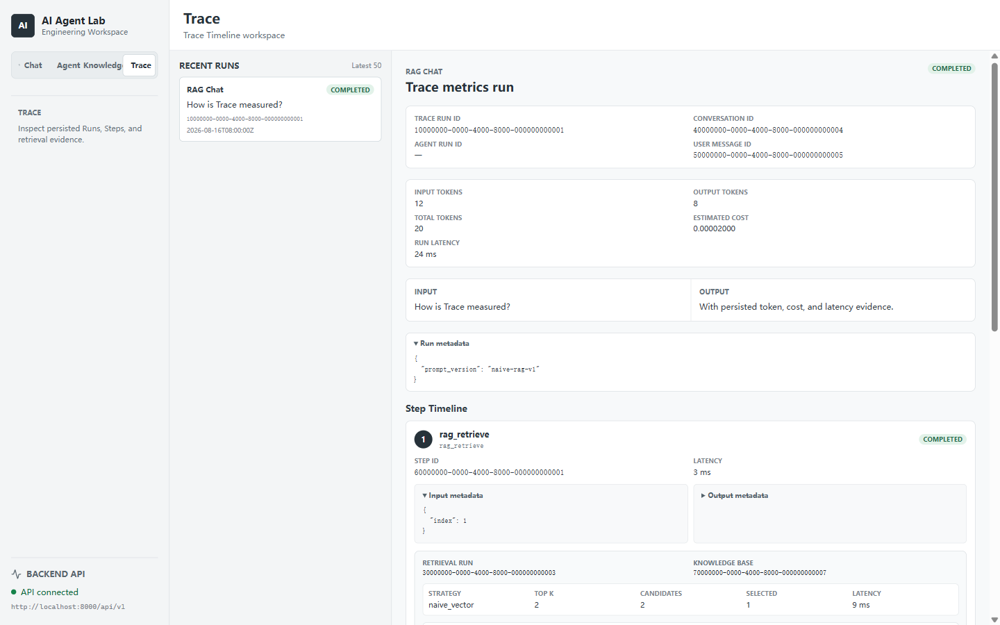
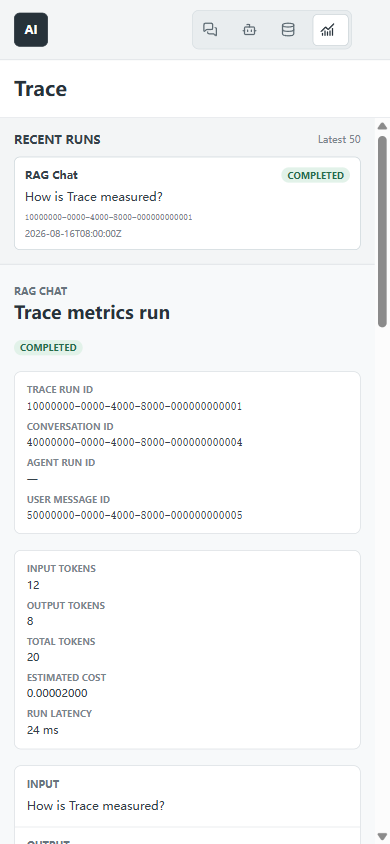

# Trace Timeline

This guide explains how to inspect the persisted Trace evidence delivered by
Plan 4 M2. The data model and write-path contracts remain defined in the
[Trace Observability Foundation](30-trace-observability.md).

## Current Scope

The current read surface covers Chat LLM calls, standalone RAG Query, and RAG
Chat. RAG Chat records ordered retrieval, Prompt construction, LLM, and final
answer Steps plus the retrieval candidates used as source evidence. The
Timeline is read-only: it does not create, resume, cancel, retry, or replay an
execution. Agent and Tool Trace hooks remain deferred.

## Open And Navigate The Workspace

Open the fourth workspace from the application sidebar. Selecting a recent Run
updates the URL to `?workspace=trace&run=<uuid>`. Opening that URL restores the
Run directly, including a valid Run that is outside the current recent-results
window. The recent list and selected detail load independently, so a failure in
one panel can be retried without discarding a successful result in the other.

Desktop acceptance reference:



Mobile acceptance reference:



## Trace Read API

The default recent-run request is:

```http
GET /api/v1/traces?limit=50
```

`limit` accepts integers from 1 through 100. Runs are ordered by
`created_at DESC, id DESC`; each summary exposes an `input_preview` bounded to
160 Unicode characters. The endpoint returns only persisted SQLite evidence
and does not initialize an LLM/Embedding Provider, Qdrant, or another external
client.

A malformed `limit` uses the shared HTTP 422 validation envelope. Do not treat
the list endpoint as an unbounded export API.

## Read A Run

Fetch one Run with:

```http
GET /api/v1/traces/<trace_run_id>
```

The detail includes the complete persisted Run envelope, ordered Steps, and
associated retrieval Runs/candidates. An unknown but valid UUID returns the
safe `trace_run_not_found` HTTP 404 error. A malformed UUID uses the shared
HTTP 422 validation envelope. Neither response exposes database or Provider
diagnostics.

Run metadata can be expanded in the Timeline. Correlation IDs such as
`conversation_id`, `user_message_id`, and `agent_run_id` remain visible when
they were recorded and have not been cleared by audit-preserving deletion.
The Run metrics card displays input, output, and total tokens, estimated cost,
and Run latency; unavailable persisted values are rendered explicitly as `—`.

## Read The Step Timeline

Steps are ordered by `step_index, id`. A successful RAG Chat normally reads:

```text
rag_retrieve -> build_prompt -> llm_call -> final_answer
```

Each Step exposes its stable ID, type, status, timing, safe error text, and
persisted JSON metadata. The `rag_retrieve` Step associates the retrieval
record through `output_json.retrieval_run_id`. Failed Provider or retrieval
paths remain inspectable with class-name-only errors; raw Provider response
bodies are not replayed.

## Read Retrieval Evidence

Retrieval Runs are ordered by `created_at, id`. Their candidates are ordered by
`rank, id`, preserving stable candidate, Chunk, and Document IDs together with
the exact non-null score fields available for the strategy. A persisted
candidate `content_preview` is bounded to 500 characters. Candidate metadata
is allowlisted before persistence and may be expanded from the Timeline.

For the current `naive_vector` strategy, `dense_score` is normally the relevant
score. Sparse, fused, final-rank, and rerank fields are reserved for later
Plan 4 strategies and are not reconstructed by this reader.

## Common Replay Patterns

- For a Chat Run, inspect the `llm_call` Step together with Provider/model,
  usage, cost, latency, and Run status.
- For a standalone RAG Query, follow `rag_retrieve` to its retrieval Run and
  verify candidate rank, selection, source IDs, and score.
- For a RAG Chat, verify Step order, follow `retrieval_run_id`, compare selected
  candidates with Prompt source metadata, and finish at `final_answer`.
- For a failed Run, inspect the last failed Step and safe class-name-only error;
  completed retrieval/Prompt evidence remains visible when it was committed by
  the failure-replay path.

## Loading, Empty, Error, And Failure States

The recent list and detail panel each provide loading, empty, error, retry, and
success handling. An empty database shows an explicit empty state. A stale or
unmounted request cannot replace a newer selection. Deep-linked failures stay
visible even when the selected Run is not among the latest 50 summaries.

## Security And Data Boundaries

Trace reads are SQLite-only and make no Provider, Qdrant, network Tool, or
other external request. The API returns the bounded evidence persisted by the
write path; it does not reconstruct a full Prompt, conversation context,
vector payload, raw Provider body, secret, or deleted source document. Source
IDs in retrieval evidence are intentional audit snapshots rather than a
promise that the operational source still exists.

## Troubleshooting

- HTTP 404 with `trace_run_not_found`: confirm the UUID and whether the Run was
  explicitly deleted.
- HTTP 422: validate the UUID shape and ensure `limit` is an integer from 1 to
  100.
- Empty recent list with a known Run ID: use the deep link; the detail endpoint
  is independent of the recent-results window.
- Candidate source unavailable: use the persisted Chunk/Document IDs and
  preview as audit evidence; source deletion is not reversed by Trace reads.
- Missing Agent/Tool history: those Trace writers are outside M2 and have not
  been partially enabled.

## Acceptance Evidence

The desktop and mobile images above are sanitized acceptance assets. Fresh
full-suite, migration, build, headed-browser, documentation, security, and Git
evidence is consolidated in the
[Plan 4 M2 final review](reviews/2026-08-16-plan4-m2-final-review.md).

## Current Limitations

- The Timeline is an inspection surface, not an execution controller.
- It does not reconstruct full prompts, source files, or vector payloads.
- Agent/Tool Trace, Advanced RAG, reranking, and Evaluation remain later Plan 4
  work.
- Early streaming cancellation and Prompt-construction failure before an LLM
  attempt do not yet produce complete durable Trace evidence.
- The recent-run endpoint is intentionally bounded and has no pagination or
  export workflow in M2.

## Verification References

Detailed implementation and contract evidence is available in:

- [M2 S1-S3 LLM Trace review](reviews/2026-08-08-plan4-m2-s1-s3-review.md)
- [M2 S4-S6 RAG Trace review](reviews/2026-08-08-plan4-m2-s4-s6-review.md)
- [M2 S7-S9 Trace API and Timeline review](reviews/2026-08-09-plan4-m2-s7-s9-review.md)
- [`test_llm_trace.py`](../backend/tests/test_llm_trace.py)
- [`test_rag_trace.py`](../backend/tests/test_rag_trace.py)
- [`test_trace_query_service.py`](../backend/tests/test_trace_query_service.py)
- [`test_trace_api.py`](../backend/tests/test_trace_api.py)
- [`TraceTimelinePage.dom.test.tsx`](../frontend/src/pages/TraceTimelinePage.dom.test.tsx)
